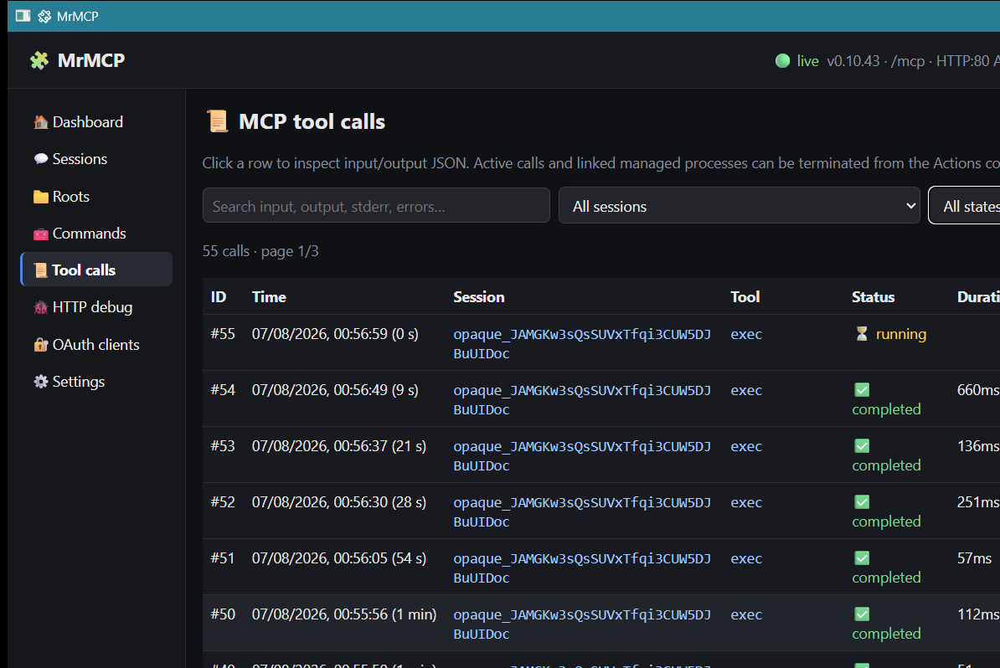

# MrMCP 0.10.43

MrMCP is a stateless Model Context Protocol server implemented in Deno. It exposes one authenticated MCP endpoint at `/mcp`, a loopback administration interface, filesystem and text-editing tools, an extra-command catalog, managed processes, a persistent JavaScript worker, OAuth and Basic authentication, TLS automation, and explicit server-issued opaque values for application state.



The desktop window uses `jsr:@webview/webview@0.9.0`, imported directly by Deno. The project has no Node.js application, npm install, CLI scaffold, Rust, Tauri or Neutralinojs runtime.

## Project files

- `mrmcp.js` — backend, MCP endpoint, SQLite schema, administration UI and desktop launcher.
- `morphlex.js` — DOM morphing engine used after Eta renders updated HTML.
- `commands.yaml` — metadata for optional executables in `.mrmcp/bin`.
- `README.md` — user and operator documentation.
- `AGENTS.md` — implementation invariants and release checks.

## Requirements and startup

Requirements:

- Deno with `node:sqlite` support.
- Native dependencies required by `@webview/webview` on the target platform.
- Permission to listen on ports 80 and 443 when the public listeners are enabled.

Desktop GUI:

```bash
deno run -A --unstable-ffi mrmcp.js
```

Headless backend:

```bash
deno run -A mrmcp.js --backend
```

The administration interface is served at `http://127.0.0.1:7332/`. Desktop mode starts the backend as a Deno child process, waits for `MRMCP_READY`, opens the authenticated loopback URL in the WebView and terminates the child when the window closes. The initial window size is 1180×760.

## MCP 2026-07-28 and stateless operation

MrMCP advertises and accepts only MCP `2026-07-28`.

That protocol revision removed the `initialize` / `initialized` handshake and the `Mcp-Session-Id` transport header. Every request is self-describing and independent. The protocol maintainers explicitly recommend that applications which need state across calls issue an ordinary explicit handle and require the model to pass it back as a tool argument.

References:

- [The 2026-07-28 Specification — No handshake or sessions](https://blog.modelcontextprotocol.io/posts/2026-07-28/#no-handshake-or-sessions)
- [SEP-2567 — Sessionless MCP via Explicit State Handles](https://modelcontextprotocol.io/seps/2567-sessionless-mcp)
- [SEP-2575 — Make MCP Stateless](https://modelcontextprotocol.io/seps/2575-stateless-mcp)

MrMCP implements that application-level pattern through the optional `server_opaque` property present in every tool input schema. It is not a transport session identifier.

### Bootstrap and reuse

1. The first tool call omits `server_opaque`.
2. MrMCP creates an `opaque_...` value, does **not** execute the requested operation, returns the value and sets `retry_required: true`.
3. The client repeats the same call with that exact value.
4. A valid value executes the operation and is repeated unchanged in the result.
5. An unknown, foreign or expired value never executes the requested operation and never causes an automatic replacement to be minted.
6. A response may explicitly instruct the client to omit the invalid value once to obtain a new one.

Every tool result repeats the state envelope:

```json
{
  "server_opaque": "opaque_...",
  "server_opaque_status": "active",
  "retry_required": false,
  "message": "..."
}
```

Possible statuses are `active`, `invalid` and `expired`. Values are scoped to the authenticated client and expire after 30 days without activity.

### Why the GUI says “Sessions”

The administration interface labels these values **Sessions** because that is convenient for an operator grouping calls, roots, process state and logs. This is only a GUI term. MrMCP does not implement protocol sessions, does not use `Mcp-Session-Id`, and does not derive identity from client transport headers.

## Authentication and tool access

Authentication is the only server-side tool-access boundary.

- Authenticated OAuth or Basic clients receive every published built-in and custom tool.
- Anonymous clients receive no tools and cannot execute operations.
- There are no tool approvals, enable lists, execution switches, `allow_re`, `deny_re` or user-defined per-tool policies.
- OAuth consent remains because it authorizes the client itself, not an individual tool call.

The only public MCP endpoint is `/mcp`. OAuth protected-resource metadata is exposed for that single resource.

## Database policy

Development builds use one exact current SQLite schema and no compatibility layer.

- The database is `.mrmcp/mrmcp.sqlite` beside the application.
- `PRAGMA user_version` must exactly equal `DB_SCHEMA_VERSION`.
- A non-empty database with another version is rejected before schema changes.
- There are no migrations, `ALTER TABLE` upgrades, backfills, aliases, old-key imports or legacy identifier acceptance.
- After an incompatible development change, stop MrMCP and delete `.mrmcp/mrmcp.sqlite`.

The current schema uses `server_config`, `roots`, `server_opaques`, `logs.server_opaque` and `process_runs.server_opaque` directly. A clean database creates no named `default` root.

## Roots and filesystem isolation

Each valid opaque value may select one named root. If none is selected, its effective root is the directory containing `mrmcp.js`.

The Roots page provides conventional management only:

- logical name;
- existing absolute directory path;
- enabled state;
- edit and delete.

There is no drag-and-drop or drop diagnostics. Relative paths and child-process working directories must remain within the effective root.

## Built-in tools

MrMCP publishes tools for:

- workspace/root selection;
- file and directory metadata;
- listing and searching files;
- UTF-aware reading, writing and exact/bulk editing;
- creating, copying, moving and deleting paths;
- publishing generated files;
- discovering extra commands;
- foreground and managed/background process execution;
- polling, stdin writes, termination and process listing;
- a persistent Deno JavaScript worker and module-directory registration.

Custom commands are described in `commands.yaml` and resolve below `.mrmcp/bin`. Executables found directly in that directory are also discoverable.

## Process environment

The setting **Include the system PATH in spawned processes and commands** is enabled by default.

- ON: `.mrmcp/bin` is prepended to the supplied or inherited system `PATH`.
- OFF: child processes receive only `.mrmcp/bin` in `PATH`.
- Other environment variables remain available.
- Shell expressions use `ComSpec` on Windows and `SHELL`, with `/bin/sh` as the Unix fallback.

## Text encoding and editing

Text tools support:

- UTF-8;
- UTF-16LE;
- UTF-16BE;
- Windows-1252;
- Latin-1;
- BOM preservation, insertion or removal;
- `LF`, `CRLF` and `CR` preservation or conversion.

Preferred editing order:

1. `edit_file` / `edit_files` for exact replacements;
2. `replace_files` for repeated literal or regular-expression replacements;
3. `write_file` / `write_files` for complete content;
4. `js` / `exec` only when the transformation genuinely requires parsing or programmatic logic.

## Administration interface

The interface contains:

- Dashboard;
- Sessions;
- Roots;
- Commands;
- Tool calls;
- HTTP debug;
- OAuth clients;
- Settings.

Projects, Active calls, Custom tools and Approvals are intentionally absent. The header and window title use **🧩 MrMCP**. Emoji are limited to navigation, headings, principal actions, destructive actions and compact states.

### Deno-owned event-driven rendering model

The GUI has no polling timer, auto-refresh setting, browser-side data fetch loop or duplicate refresh path. Deno is the only owner of graphical state.

The backend keeps one ephemeral `uiState` object containing:

- the current section and per-section scroll positions;
- focus and selection information needed after a morph;
- command search, page, page size and availability filter;
- Tool-call filters, numbered page and expanded database primary key;
- HTTP-debug filters and expanded database primary key;
- active dialog, confirmation or message;
- in-progress Root, Command and Settings drafts;
- self-test output and the last processed browser-input sequence.

The WebView does not keep an application-state object and does not query administrative JSON endpoints. Its responsibilities are deliberately narrow:

1. delegate click, change, input, submit, focus, keyboard and scroll events;
2. serialize those events and send them to Deno over `/api/ui-input` WebSocket;
3. receive complete server-rendered UI HTML over `/api/events` SSE;
4. apply the HTML to `#app` with Morphlex;
5. restore the scroll and focus values supplied by Deno.

Deno processes browser events sequentially. It updates `uiState`, executes database/filesystem/process actions, and schedules a render only when required. MCP calls, process changes, logs, OAuth changes, TLS changes and other backend subsystems use the same render scheduler.

Rendering is queued rather than performed synchronously inside the triggering operation. A short throttle coalesces bursts, only one render runs at a time, and additional requests received during a render cause one subsequent pass. Eta rendering uses its asynchronous API when available. When rendering completes, Deno broadcasts one `render` SSE event containing the full `#app` HTML and the authoritative scroll/focus metadata.

Eta chooses the active section with a conditional. `buildUiRenderModel()` queries only the data required by that section, then Eta renders the sidebar, active section, dialogs and section-specific rows. Inactive sections are neither rendered nor queried. Expanded Tool-call and HTTP rows are identified by their unique database primary key and are reconstructed by Eta after relevant backend events.

Native confirmation and alert state is not kept in the browser. Confirmations, errors and forms are represented in Deno `uiState` and rendered as ordinary Eta dialogs. The browser may perform a local clipboard write because that operation carries no application or graphical state.

### Tool-call log

The Tool calls page supports:

- filter by GUI session and status;
- full-text query;
- numbered pagination above the table;
- complete timestamps with compact relative ages;
- compact rows without inline input/output JSON;
- Eta-rendered expanded details;
- Terminate and Force controls only when cancellation is real.

## TLS and connectivity

MrMCP uses fixed public listeners:

- port 80 for ACME HTTP-01 challenges;
- port 443 for MCP, OAuth and metadata;
- loopback port 7332 for the administration UI.

The Settings and Dashboard pages display listener state, active certificate, validity, trust, expiry, ACME request history, backoff and next attempt. A valid certificate already stored in `.mrmcp` is reused.

## Development changelog

### 0.10.43

- Expanded `AGENTS.md` with the full UI-state design rationale and failure mode that motivated the architecture.
- Made explicit that every visible state transition, including navigation and row expansion, is Deno-owned and Eta-rendered.
- Documented normalized user/backend event handling, primary-key-based expanded rows, lazy section-scoped queries and the single throttled asynchronous render queue.
- Added release checks that reject imperative browser UI state and inactive-section data loading.

### 0.10.42

- Moved every ephemeral graphical state value from the WebView into the Deno backend.
- Replaced browser-side `globalThis.mrmcpUiState`, `/api/state` and `/api/render` calls with a WebSocket input channel and an SSE HTML output channel.
- Added a single sequential Deno input dispatcher for navigation, forms, filters, pagination, expanded rows, dialogs, focus and scroll.
- Added a throttled/coalescing asynchronous render queue; backend and MCP events use the same queue.
- Changed the WebView into a thin event sender and Morphlex HTML receiver.
- Made confirmations and error messages server-owned Eta dialogs.

### 0.10.41

- Added a real global ephemeral UI state object.
- Restored the missing unified `dispatchUiEvent` implementation that prevented sidebar navigation.
- Moved current section, filters, pages, expanded row primary keys, dialogs and self-test output into the state object.
- Eta now conditionally renders only the current section; Morphlex applies every UI transition.
- Added section-specific server projections so inactive pages do not query their tables.
- Moved expanded Tool call and HTTP details from imperative DOM insertion into Eta templates.
- Expanded README and AGENTS documentation, including the MCP 2026-07-28 stateless rationale.

### 0.10.40

- Added a restrained emoji vocabulary for faster visual scanning.

### 0.10.39

- Removed experimental root drag-and-drop and diagnostics.
- Restored conventional root creation, editing, enable/disable and deletion.

### 0.10.38

- Reduced the initial desktop window to 1180×760.

### 0.10.37

- Standardized visible branding as **MrMCP** and added the 🧩 header/window icon.

### 0.10.36

- Replaced GUI polling with SSE-driven Eta → Morphlex updates.

### 0.10.35

- Renamed the operator view to Sessions.
- Removed the global default-root option; unassigned values use the `mrmcp.js` directory.

### 0.10.34

- Returned the desktop launcher to direct `@webview/webview` after superseded Tauri and Neutralino experiments.

### 0.10.32–0.10.33 — superseded experiments

- Explored Neutralino-based desktop shells; fully removed in 0.10.34.

### 0.10.29 — superseded experiment

- Explored a Tauri v2 desktop shell; fully removed in 0.10.34.

### 0.10.30–0.10.31

- Replaced transport-derived session identity with explicit tool arguments for the stateless protocol.
- Stabilized the final field name as `server_opaque` and removed “context” terminology from agent-facing schemas.

### 0.10.28

- Removed tool-call approvals and every associated queue, state and database field.
- Removed `allow_re` and `deny_re`; authentication became the only tool-access boundary.

### 0.10.27

- Added session-oriented administration, root assignment, tool-call pagination and termination controls.
- Added encoding, BOM and line-ending controls to text tools.
- Added the system-PATH process setting.

### 0.10.24–0.10.26

- Added relative ages beside log timestamps.
- Consolidated to one `/mcp` endpoint.
- Introduced early session/root and event-log improvements that were later adapted to explicit opaque handles.
