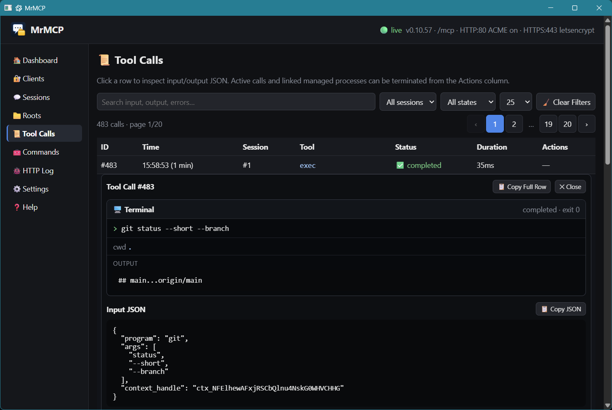
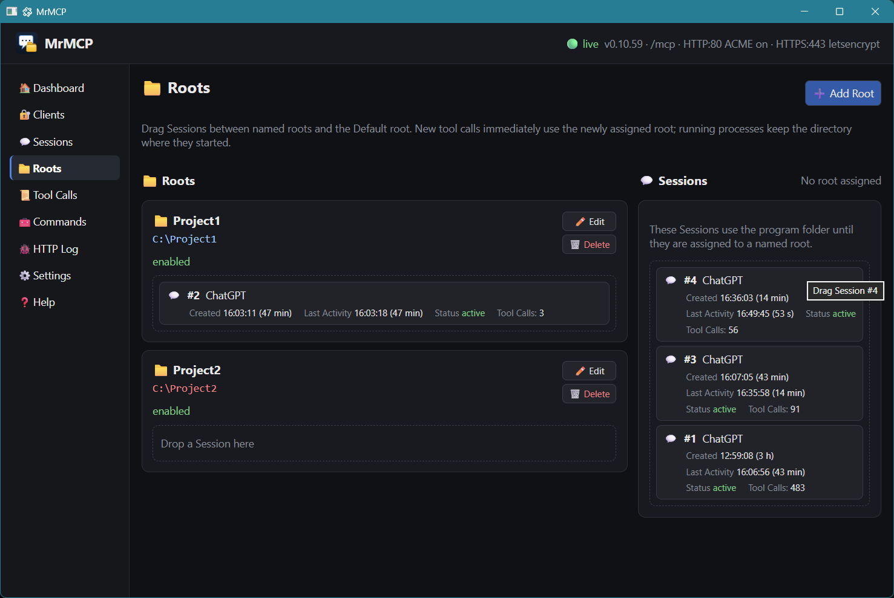

<p align="center"></p>

# MrMCP 0.10.100

MrMCP is a stateless Model Context Protocol server implemented in Deno. It exposes one authenticated MCP endpoint at `/mcp`, a local Tauriless administration interface, filesystem and text-editing tools, an extra-command catalog, managed processes, a persistent JavaScript worker, OAuth and Basic authentication, TLS automation, and explicit Session `context_handle` capabilities.

### Tool Calls

Expanded process calls show the full terminal-style command, optional stdin and combined output above the raw input, raw tool return value and final MCP result JSON. Every compact Tool Call row and desktop Tool Call notification shows the tool plus a short argument preview: up to six top-level arguments, 48 characters per value and 180 characters overall, with excess arguments collapsed to `… +N args`. Session bearer handles are omitted from previews. The `exec*` family keeps its command-aware form, using only the executable basename and resolving related process calls back to the command when available. When the MCP request supplied `_meta.progressToken`, the Tool Call row/detail and desktop notification also show **📡 Progress requested**; this transport metadata is stored separately from the tool arguments.



### Workspaces

Named Workspaces and their Sessions are managed in one drag-and-drop view, with activity, status and Tool Calls counts visible on each Session.



The desktop window uses Tauriless through a pinned literal dynamic Deno import inside `desktop()`: `await import("npm:@mefistofelix/tauriless@0.1.12")`. The backend Worker never evaluates Tauriless, because its module opens the native library eagerly with `Deno.dlopen`; this keeps the native bridge loaded only once in the process and avoids duplicate Objective-C class registration on macOS. Desktop mode keeps one OS process: Tauriless runs on the main OS thread with a ~16 ms Deno drain timer while the backend runs in a Deno Worker/isolate in the same executable. MrMCP has no hand-written FFI wrapper, vendored Tauriless native binaries, Node.js application, npm project, CLI scaffold, Rust/Tauri scaffold or Neutralinojs runtime.

## Project files

- `mrmcp.js` — backend, MCP endpoint, SQLite schema, administration UI and desktop launcher.
- `commands.yaml` — editable extra-command catalog. Source mode reads this root file directly; standalone builds embed it as the first-run template and materialize it beside `mrmcp.exe` only when no physical `commands.yaml` exists.
- `README.md` — user and operator documentation.
- `AGENTS.md` — implementation invariants and release checks.
- `.github/workflows/release.yml` — tag-driven release workflow that cross-compiles and publishes four standalone binaries: Windows x64, Linux x64, macOS x64 and macOS Apple Silicon (arm64).
- `.github/workflows/test-macos.yml` — native macOS GUI smoke test on GitHub-hosted Intel and Apple Silicon runners; it builds and launches MrMCP and fails if the real WebView bootstrap exits or reaches its 10-second timeout.
- `assets/` — static WebView/build assets: `morphlex.js`, SVG/PNG branding, Windows ICO and administration screenshots.

## Requirements and startup

Requirements:

- Deno with `node:sqlite` support.
- Tauriless support for the target platform, provided internally by the `@mefistofelix/tauriless` npm package.
- Permission to listen on ports 80 and 443 when the public listeners are enabled.

Desktop GUI:

```bash
deno run -A --unstable-ffi mrmcp.js
```

Headless backend:

```bash
deno run -A mrmcp.js --backend
```

The administration interface is local-only and opens no GUI network listener. Desktop mode starts the backend in a Deno Worker in the same OS process, waits for a typed `ready` message, removes unused Tauriless forwarded-event subscriptions before the WebView exists, creates the `main` Tauriless webview window on the main OS thread, and serves `index.html` through Tauriless' `asset-request` / `tauriless:asset-response` protocol. Close-requested, destroyed, native directory drop, resize/focus/blur visibility signals and the built-in `tauriless://webview-message` host event remain subscribed. Small GUI assets are embedded in the local HTML response. Browser text edits are coalesced before crossing the event bridge; actions, changes, blur, submit and navigation flush pending edits first. Rendered Eta HTML returns through the Tauri event bus before Morphlex applies it. There is no GUI login token, cookie, session or CSRF layer. Deno drains Tauriless every ~16 ms; when the window is destroyed, MrMCP gracefully shuts down the Worker, closes Tauriless and exits. The main window is created hidden, forced to a logical 1180×760 inner size, centered and only then shown.

Desktop mode also sets a native MrMCP window icon and creates a system-tray icon whose menu contains only **Quit**. A left click on the tray toggles the main window between visible and hidden; if the window is minimized, the tray click restores it and brings it to the foreground instead of hiding it. Clicking the window X hides it without terminating MrMCP. Native directory drag/drop automatically adds enabled Workspaces: non-directory drops are ignored, an already configured effective path is a no-op, and the globally unique Workspace name uses the final directory name with the first free `Name`, `Name #2`, `Name #3`, ... form. **Desktop Notifications** has independent checkboxes for Session, Workspace and Tool Call notifications, all enabled by default (existing installs inherit the previous global setting until these per-type values are saved). Session notifications are lifecycle events: **New Session**, **Session Active** after at least 10 minutes without a Tool Call, and **Workspace Opened**. Notification titles do not repeat `MrMCP` because Windows already identifies the application. Whenever a notification names a Session, it uses a short multiline summary: `💬 Session #12`, followed by `📁 php-xmake`, `🕒 42min` and `🛠️ 37 Tool Calls`. Event titles use concise emoji labels such as `✨ New Session`, `🟢 Session Active`, `📂 Workspace Opened` and `🛠️ Tool Call`; multi-Workspace notifications use short bulleted groups. On Windows, before the first WebView is created, MrMCP calls Tauriless `tauriless:set-app-user-model-id` with `Deno.execPath()` and then uses the ordinary Tauri notification plugin; for a standalone build this makes the explicit AppUserModelID the absolute path of `mrmcp.exe`.

Public listener ports are runtime-resolved without changing configuration. If HTTP 80 or HTTPS 443 is already occupied, that listener retries at `base + 50` repeatedly until it binds (for example 80→130 or 443→493). The GUI has no listener or fallback port. The compact header groups version, live/fallback state and effective HTTP/HTTPS ports, recently active Sessions with `#id(total Tool Calls)`, and Tool Calls total/in-flight/error/invalid counts. Useful header values are server-routed shortcuts: ports open Settings, active opens all Sessions, a recent `#Session` opens that Session's Tool Calls, and in-flight/total/errors/invalid open Tool Calls filtered to running/all/failed/invalid. Every shortcut only sends a normalized Tauri event; Deno updates `uiState` and Eta renders the result through the normal Tauri-event/Morphlex pipeline. Related values use semantic text colors: active green, in-flight yellow, errors red, invalid purple and totals/session counters blue-neutral. A Session is considered active when it has started a Tool Call within the last ten minutes; at most the four most recently active Sessions are listed. ACME HTTP-01 is available only when the effective HTTP listener is still port 80; fallback instances may reuse existing certificates but cannot perform HTTP-01 issuance on the fallback HTTP port.

Port fallback only resolves listener collisions; it does not isolate application data. Parallel MrMCP instances intended for testing should be run from separate program directories so each has its own `.mrmcp` data directory and editable `commands.yaml`.

The local GUI does not expose `/assets/...` routes. Its small CSS, Morphlex bootstrap and logo data are delivered inside the Tauriless local asset response. MCP `serverInfo` still advertises the MrMCP PNG logo at `${publicBase()}/mrmcp-icon.png`; that exact read-only HTTPS path is intentionally public so remote clients can fetch the icon. With `deno run`, source assets come from the repository `assets/` directory. Standalone builds embed that directory with `deno compile --include assets`, so the local GUI and public icon still use the same versioned files. `commands.yaml` is not a WebView asset: compile it separately with `--include commands.yaml`; on first standalone backend startup, MrMCP copies the embedded template beside the executable only if no editable physical `commands.yaml` exists there.

Windows standalone build:

```powershell
deno compile -A --unstable-ffi --no-terminal --include assets --include commands.yaml --icon assets/mrmcp.ico --output mrmcp.exe mrmcp.js
```

`--no-terminal` makes the Windows standalone executable a GUI application, so launching `mrmcp.exe` opens the WebView without an additional console window. Source-mode `deno run` remains a normal terminal process for development and diagnostics.

### Release binaries

Pushing a version tag matching `mrmcp.js` `VERSION` (for example `0.10.98`) runs `.github/workflows/release.yml` with Deno 2.9.5. The workflow checks the source, cross-compiles from one GitHub Linux runner, creates or updates the GitHub Release, and uploads exactly these project-built assets:

- `mrmcp-windows-x64.exe`
- `mrmcp-linux-x64`
- `mrmcp-macos-x64`

All three embed `assets/` and `commands.yaml`; the Windows target additionally keeps `--no-terminal` and the MrMCP ICO. Tauriless 0.1.11 currently ships native desktop bindings for `win32-x64`, `linux-x64` and `darwin-x64`, so the macOS release is x64; Apple Silicon Macs require Rosetta 2 for this build.

## MCP 2026-07-28 and stateless operation

MrMCP advertises and accepts only MCP `2026-07-28`.

That protocol revision removed the `initialize` / `initialized` handshake and the `Mcp-Session-Id` transport header. Every request is self-describing and independent. The protocol maintainers explicitly recommend that applications which need state across calls issue an ordinary explicit handle and require the model to pass it back as a tool argument.

`/mcp` uses modern request-scoped Streamable HTTP. Ordinary RPCs and `exec`/foreground custom commands without `_meta.progressToken` return one `application/json` response. When `_meta.progressToken` is supplied and the client accepts SSE, foreground `exec` and custom commands use request-scoped `text/event-stream`: normalized combined process output is emitted as standard `notifications/progress` batches of at most 16 KiB or 100 ms, followed by the normal final JSON-RPC result containing the complete process transcript. `exec_attach` may use request-scoped SSE even without a progress token because its no-progress mode is a long-poll read that waits for output before returning its final result. There is no legacy persistent `/sse` endpoint or GET event stream.

HTTP content compression is owned by Deno rather than by MrMCP application code. Both public `Deno.serve` listeners run with `automaticCompression: true`; Deno negotiates supported content encodings for MIME types it considers compressible. In the current Deno runtime, ordinary text/JSON responses are compressed when negotiated, while `text/event-stream` is left uncompressed by the native compressor. MrMCP does not add a manual zlib/Brotli layer, does not require `Content-Length` before compression and does not manage HTTP chunk/data framing.

References:

- [The 2026-07-28 Specification — No handshake or sessions](https://blog.modelcontextprotocol.io/posts/2026-07-28/#no-handshake-or-sessions)
- [SEP-2567 — Sessionless MCP via Explicit State Handles](https://modelcontextprotocol.io/seps/2567-sessionless-mcp)
- [SEP-2575 — Make MCP Stateless](https://modelcontextprotocol.io/seps/2575-stateless-mcp)

MrMCP implements that application-level pattern with `open_workspace(name, current_context_handle?)`. A Workspace name is globally unique. With a valid active `current_context_handle`, opening a Workspace moves that same persistent Session to the Workspace and preserves its handle; with an omitted, empty, unknown or expired value, MrMCP creates a new Session there. Every later tool requires the returned handle.

### Open a Workspace and reuse the Session

1. If the Workspace name is not already known, call sessionless `list_workspaces` to retrieve the enabled names. Then call `open_workspace` with the exact desired Workspace `name`. The published `name` schema is a free string rather than an enum of currently configured Workspaces; the server validates that the supplied name exists and is enabled when the call runs. Optionally pass the Session you are already using as `current_context_handle`.
2. If `current_context_handle` is active, MrMCP moves that same Session to the named Workspace and returns the same `ctx_...` handle. If it is omitted, empty, unknown or expired, MrMCP creates a new Session in that Workspace and returns its new globally unique, unguessable handle.
3. The `open_workspace` result includes `workspace_name`, the absolute Workspace `cwd` and, when present, `agent_guidance_path` pointing to the Workspace-level `AGENTS.md` or `agents.md`; read and follow that file before repository work.
4. Pass the exact returned handle unchanged in `context_handle` on every later Session-bound tool call. To switch Workspaces from MCP, call `open_workspace` again with that handle as `current_context_handle`.
5. `list_workspaces` remains sessionless. For tools other than `list_workspaces` and `open_workspace`, a missing, unknown or expired required `context_handle` does not execute the requested operation and never mints a replacement automatically.

Successful Session-bound tool results repeat only the bearer capability as common metadata; `list_workspaces` returns only its Workspace-name list:

```json
{
  "context_handle": "ctx_..."
}
```

For tools that require `context_handle`, a missing, invalid or expired handle returns `isError: true` with an `error` message explaining that `open_workspace` must be called with a Workspace name. Those calls never mint a replacement automatically. `open_workspace` itself treats an omitted, empty, unknown or expired `current_context_handle` as a request for a new Session. Sessions expire after 30 days without activity.

The handle itself selects the Session after authentication. MrMCP does not bind Sessions, processes or JavaScript kernels to the OAuth client or Basic credential that created them. Any authenticated client possessing a valid handle can use that Session. The Session row records best-effort metadata about the client that created it (authentication kind, OAuth client id/name when available, and User-Agent) for operator visibility only; those fields are not authorization or ownership controls.

### Why the GUI says “Sessions”

The administration interface labels persistent application handles **Sessions**. Each row is identified in the GUI by a short numeric primary key; the long `ctx_...` bearer capability remains the MCP tool capability. MrMCP still does not implement transport sessions and does not use `Mcp-Session-Id`.

The Sessions table also shows best-effort creation-client metadata. MCP does not reliably expose the ChatGPT model or thinking/reasoning level, so MrMCP does not invent those values. Changing model or thinking level in the same ChatGPT conversation may cause ChatGPT to open another MrMCP Session, so the same GUI Session is not guaranteed to persist across such changes.

## Authentication and tool access

Authentication controls access to MrMCP; `context_handle` selects persistent state after authentication.

- Authenticated OAuth or Basic clients receive every published built-in and custom tool.
- Anonymous clients receive no tools and cannot execute operations.
- There are no tool approvals, enable lists, execution switches, `allow_re`, `deny_re` or user-defined per-tool policies.
- OAuth consent authorizes the client itself, not an individual tool call.

The public OAuth consent screen is generic for every compatible client and is rendered server-side with Eta. It uses the same dark palette as the administration GUI and a compact centered card at roughly half the desktop viewport width. The card width is driven by `vw`, while typography combines `vw` and `vh` instead of using `vmin`, so a short landscape browser viewport cannot shrink otherwise readable text. Logo, spacing and actions remain viewport-relative; client, requested scope, MCP resource, registered return destination and both actions stay visible without scrolling in a normal desktop viewport. **Authorize Access** is green and **Cancel** is red; there is no extra trust-notice or redundant footer block. Invalid or expired authorization requests use the same branded Eta layout. After approval or denial MrMCP follows the normal OAuth flow and redirects directly to the client's registered callback; there is no client-specific or intermediate success page.

The only public MCP endpoint is `/mcp`. OAuth protected-resource metadata is exposed for that single resource.

## Database policy

SQLite is treated directly as persistent application state; MrMCP does not maintain a database schema version or gate startup on `PRAGMA user_version`.

- The database is `.mrmcp/mrmcp.sqlite` beside the application.
- Startup ensures current tables and indexes with `CREATE TABLE IF NOT EXISTS` / `CREATE INDEX IF NOT EXISTS`, so additive structures become available automatically on an existing database.
- There are no `ALTER TABLE` migrations, backfills, aliases, old-key imports or legacy identifier acceptance.
- Startup still verifies the columns that current code actually requires. If an existing table has an incompatible shape, stop MrMCP and recreate `.mrmcp/mrmcp.sqlite` rather than adding compatibility code.

The current schema gives every Session a numeric administrative primary key in `contexts.id` while retaining a unique opaque `context_handle` for MCP calls. Tool-call and process rows store both the numeric `context_id` snapshot used by the GUI and the opaque handle used by tools. Sessions additionally store creation authentication kind, OAuth client id/name when available, and User-Agent as observational GUI metadata. Internally each Session stores one current `root_id`; that legacy persistence name is not exposed as MCP terminology. Named Workspace names are globally unique with `UNIQUE(name)`. Internal id `0` denotes the program-directory fallback for an existing Session whose Workspace was removed or disabled; `open_workspace` never opens a new Session into that fallback.

## Workspaces and filesystem isolation

The Workspaces page registers named directories and shows the Sessions currently attached to each Workspace. Workspace names are globally unique. Paths may be absolute or relative; MrMCP stores the entered value unchanged and resolves relative paths against the program folder only when the Workspace is actually used. Name/path errors are shown inline beside the field and disable Save; browser-native validation bubbles and error popups are not used. Path existence/type validation runs when the path field loses focus.

- `open_workspace(name, current_context_handle?)` accepts any Workspace name as a string and validates it at execution time; it moves an active current Session directly into the enabled named Workspace while preserving its handle, or creates a new Session there without a usable current handle.
- Dragging an existing Session between Workspace cards reassigns it in one step.
- The program-folder fallback bucket is available only for existing Sessions whose named Workspace is removed/disabled or explicitly cleared by the operator; it is not a valid `open_workspace` target.
- Disabled Workspaces remain visible for editing/deletion but cannot be opened or receive Sessions.
- The Sessions page shows the current Workspace name and path as read-only information; reassignment is performed from Workspaces.
- A Workspace may be assigned to any number of Sessions, while every Session has exactly one effective Workspace/fallback directory.
- Changing a Session's Workspace affects new tool calls immediately; existing background or interactive processes continue in the directory where they started.
- Disabling or deleting a Workspace moves currently associated Sessions to the program-folder fallback without terminating processes.

`open_workspace` returns `workspace_name`, the absolute Workspace `cwd` and a nullable absolute `agent_guidance_path`. MrMCP checks only that Workspace's `AGENTS.md`, then `agents.md`; it does not scan parent or child directories. When the path is present, the agent must read and follow that file before modifying the repository. Internal Workspace ids and fallback metadata are not exposed.

All relative paths and new child-process working directories must remain inside the Workspace captured at the start of the tool call.

## Built-in tools

Session and Workspace:

- `list_workspaces` — sessionless read-only discovery; returns only the names of enabled Workspaces;
- `open_workspace` — requires the globally unique enabled Workspace `name` as a free string; optionally reuses and switches an active `current_context_handle`, otherwise creates a new Session, and directly returns `workspace_name`, `cwd` and nullable `agent_guidance_path`;
- `query_tool_calls` — query calls that actually reached MrMCP for the same `context_handle`, with exact tool/status filters, literal full-record text search, stable backward pagination and a bounded result limit.

Filesystem and text:

- `read_file`, `read_files`, `write_file`, `write_files`;
- `glob`, `grep`, `edit`, `replace`;
- `file_info`, `create_directory`, `copy_path`, `move_path`, `trash_paths`, `untrash_action`;
- `publish_file`, `publish_html`.

`publish_file` is the single supported file-presentation path for ChatGPT. After a file has been created, call `publish_file` with its path instead of reading it as Base64 or trying to manufacture an inline/image/resource-link response. MrMCP creates a temporary HTTPS URL in the tool's structured result and attaches its MCP App widget. The widget renders `image/*` files with an ordinary HTML ``; PDFs, archives, databases and other MIME types get a compact **Open File** action. Raw MCP `resource_link` and inline-Base64 preview modes are intentionally not exposed because the working ChatGPT presentation path is the attached widget. `exec` therefore does not have `return_files` shortcuts: create the output with `exec`, then call `publish_file` explicitly.

`publish_html` is the generic interactive-presentation path. The agent supplies a complete HTML document plus an optional title/height; MrMCP stores it in the `published_html` SQLite table and returns a persistent unguessable HTTPS URL, so the resource continues to work after a server restart. Its attached MCP App loads that URL inside a second iframe sandboxed with scripts, forms, modals and popup links enabled but without `allow-same-origin`, keeping the generated document isolated from the MCP App and ChatGPT host DOM; origin-dependent storage/cookie APIs may consequently be unavailable. Self-contained HTML/CSS/JavaScript is the portable choice. Remote images, fonts, scripts/modules, `fetch`/WebSocket calls and other network dependencies can depend on the current host's CSP/browser behavior and normal CORS rules, so agents should not assume external networking is portable. The entire MCP request, including the HTML string and JSON envelope, remains subject to MrMCP's current 2 MiB request-body limit.

Commands and persistent execution:

- `list_commands`;
- `exec`, `exec_start`, `exec_attach`, `exec_write`, `exec_kill`, `exec_list`, `exec_status`;
- `js`, `js_add_node_module_dir`, `js_reset`.

`edit` accepts multiple files and multiple ordered exact edits per file. Each file is read once, its edits are applied sequentially in memory, every expected occurrence count is validated, and all files are written atomically with rollback.

Command execution tools normalize process output before buffering or streaming. ANSI/OSC/control sequences are removed, standalone carriage-return progress updates become separate lines, and stdout/stderr are combined in the order MrMCP observes the two pipes. `exec` is foreground and request-scoped and retains the complete normalized transcript for the whole call. Without `_meta.progressToken`, it returns one final JSON result when the child exits. With `_meta.progressToken` and SSE support, it additionally emits the new output incrementally in 16 KiB / 100 ms progress batches, then returns the same complete transcript in the final result. Terminating/disconnecting the active request terminates the child. Foreground custom commands use the same progress behavior.

Persistent execution is explicitly id-based. `exec_start` starts the process, retains the complete normalized stdout/stderr transcript, records client stdin writes internally, keeps stdin open and returns immediately with `exec_id`. That integer is exactly the Tool Call id of the `exec_start` operation, so it is monotonic and unique; it is usable only together with the same `context_handle` that created it. No client-chosen label, public internal process id or OS PID is part of the MCP contract. `exec_attach(exec_id)` consumes unread combined output through an internal per-process cursor. With `_meta.progressToken`, it emits unread backlog as progress, follows live output until exit/kill and finally returns the complete unread transcript covered by that attachment. Without a progress token, it is a long-poll/chunk API without public offsets: existing unread data returns immediately up to 16 KiB; otherwise it waits for output, then returns when 16 KiB accumulate or 100 ms have elapsed after the first new data. `remaining_bytes` is the UTF-8 byte count already buffered after the returned chunk; call again immediately while it is positive, or call again with `remaining_bytes=0,status=running` to wait for future output. Disconnecting attach only detaches and never kills the persistent child. `exec_write(exec_id)` writes/closes stdin and `exec_kill(exec_id)` terminates a still-running persistent child. `exec_list` lists only currently running persistent executions in the same Session. `exec_status(exec_id)` is non-consuming and works for running or recently completed/failed/timed-out/killed processes while their in-memory record is retained: `output=none` returns metadata only, `output=all` returns the complete retained combined transcript, and `output=tail` returns the last `tail_lines`; `separate_streams=true` applies the same selection to stdout/stderr. Completed records are normally retained for up to 24 hours but do not survive a server restart. Tool Calls/admin views may still expose internal process ids/PIDs for diagnostics.

Managed termination uses the child-process API supplied by Deno/Node directly; MrMCP does not launch `taskkill`, `kill`, `pkill` or another platform command. `Terminate` requests `SIGTERM` and `Force` requests `SIGKILL`. On Unix these are distinct signals; on Windows Node's child-process implementation terminates the managed child without providing Unix signal semantics, so the two controls may have the same practical effect. Core Deno/Node provides no portable recursive process-tree kill API, so MrMCP deliberately targets the managed child rather than claiming cross-platform descendant termination. Parent exit still completes the MCP call after a short output-drain window even if descendants inherited its pipes.

`query_tool_calls` reads only the supplied Session's `context_handle` history and excludes its own currently running call. `limit` defaults to 10 and is bounded to 1–50; `tool` and `status` are exact filters; `query` is a case-insensitive literal substring search across the complete stored log row; `before_id` returns only older stable log ids for backward pagination. Filters can be combined. The tool proves which requests reached MrMCP and shows their input, resolved result/output, status, timing and errors. Requests that reach MrMCP but fail protocol, tool-name, context or input-schema validation are recorded as `invalid`, never executed, and retain the received input plus the MCP/JSON-RPC error result returned to the client where a response body exists. Published tool input schemas remain strict; MrMCP mirrors the same validation server-side only as a defensive diagnostic layer for clients that send invalid calls anyway. A request rejected by a client/platform wrapper before MCP dispatch cannot be present, and MrMCP cannot expose an upstream reason code that was never delivered to the server.

`trash_paths` is the removal path for files and directories. It accepts explicit Workspace-relative `paths`, an optional Workspace-relative `glob`, or both. Each call creates `.mrmcp/trash/<action_id>/` plus sibling metadata `.mrmcp/trash/<action_id>.json` inside the selected Workspace; the action id is the local date/time to the second with `-2`, `-3`, ... added only on collision. `.mrmcp` is reserved metadata and is excluded from trash selections/globs. Nested selections are collapsed so moving a selected directory does not separately move its children. `untrash_action(action_id)` restores the whole action or restores nothing: it preflights every original target first and rolls back any moves if a restore step fails. MrMCP intentionally exposes no permanent filesystem-delete tool; removal is reversible through trash actions.

`glob`, `grep` and `replace` are intended to remove the need for improvised `uv`, Python or shell scripts during ordinary repository work:

- `glob` supports a start path, glob pattern, exclusions, hidden files, dependency directories and a result limit;
- `grep` supports literal or regular-expression matching, case sensitivity, globs, exclusions, context lines, hidden/dependency traversal, encoding selection, file-size limits and `content`, `files_with_matches` or `count` output;
- `replace` supports the same traversal controls, literal or regex replacements, preview mode, encoding/BOM/line-ending preservation, atomic rollback and an optional exact `expected_replacements` guard.

Every built-in tool publishes a strict tool-specific output schema. The only common field is `context_handle`; failed calls additionally use `isError: true` and an `error` string. Internal log identifiers and derived status flags are not exposed through tool results.

JavaScript kernels are created lazily and keyed internally by `(context_handle, root_id)`. Switching a Session to another Workspace uses or creates that Session-Workspace kernel; switching back reuses its previous state. Different Sessions never share JavaScript globals even when they use the same Workspace.

Custom commands are described in `commands.yaml` and resolve below `.mrmcp/bin`. Executables found directly in that directory are also discoverable.

## Process environment

The setting **Include the system PATH in spawned processes and commands** is enabled by default.

- ON: `.mrmcp/bin` is prepended to the supplied or inherited system `PATH`.
- OFF: child processes receive only `.mrmcp/bin` in `PATH`.
- Other environment variables remain available.
- Shell expressions use `ComSpec` on Windows and `SHELL`, with `/bin/sh` as the Unix fallback.

## Text encoding and editing

Text tools support:

- UTF-8;
- UTF-16LE;
- UTF-16BE;
- Windows-1252;
- Latin-1;
- BOM preservation, insertion or removal;
- `LF`, `CRLF` and `CR` preservation or conversion.

Preferred editing order:

1. `edit` for one or more ordered exact edits per file and atomic multi-file changes;
2. `replace` for repeated literal or regular-expression replacements across files;
3. `write_file` / `write_files` for complete content;
4. `js` / `exec` only when the transformation genuinely requires parsing, computation or other programmatic logic.

## Administration interface

The interface contains:

- Dashboard;
- Clients;
- Sessions;
- Workspaces;
- Tool Calls;
- Commands;
- HTTP Log;
- Settings;
- Help.

Projects, Active calls, Custom tools and Approvals are intentionally absent. The Clients page shows OAuth client creation time, first/last Session creation, latest access-token issue and latest refresh-token use, each with the same full/current-day timestamp plus compact relative age used elsewhere in the GUI. The Dashboard includes a compact **Active Tool Calls** table containing every in-flight call plus calls completed during the previous five seconds. Each row shows final/live state, the same bounded tool/argument summary used elsewhere, Session number, elapsed time and **📡 progress** when the client requested MCP progress. Completed rows fade during their short retention window and are removed by a Deno-owned one-shot render timer; there is no browser polling or browser-owned countdown. The Dashboard also exposes reversible-removal activity directly from completed Tool Call logs: separate Trash and Untrash cards show the completed-operation count plus the latest completion time, `action_id` and absolute trash path. For Untrash the displayed trash path is historical because a successful restore removes that action directory. Failed attempts do not increment either counter. The GUI header and favicon use the MrMCP balloon+folder brand mark; the native window title remains **🧩 MrMCP**. Emoji are limited to navigation, headings, principal actions, destructive actions and compact states.

### Deno-owned event-driven rendering model

The GUI has no polling timer, auto-refresh setting, browser-side data fetch loop or duplicate refresh path. Deno is the only owner of graphical state.

The backend keeps one ephemeral `uiState` object containing:

- the current section and per-section scroll positions;
- focus and selection information needed after a morph;
- the optional OAuth-client filter on Sessions;
- command search, page, page size and availability filter;
- Tool-call query, Session-PK/status filters, numbered page and expanded database primary key;
- HTTP-debug filters and expanded database primary key;
- active confirmation/form dialog and non-modal notice balloon;
- in-progress Workspace, Command and Settings drafts plus inline validation state;
- self-test output and the last processed browser-input sequence.

The WebView does not keep an application-state object and does not query administrative JSON endpoints. Its responsibilities are deliberately narrow:

1. delegate click, change, input, blur/focus, submit, keyboard and scroll events;
2. serialize those events and emit them through Tauri `plugin:event|emit`; text-input drafts are coalesced before crossing to the host, while action/blur/change/submit/navigation flush pending input first so no final edit can be lost; internal Session-to-Workspace drag data still carries only the numeric Session PK and never mutates visible DOM state;
3. receive complete server-rendered UI payloads from the host through Tauri `plugin:event|listen` / `plugin:event|emit_to`;
4. apply the HTML to `#app` with Morphlex;
5. restore the scroll and focus values supplied by Deno.

Deno processes browser events sequentially. It updates `uiState`, executes database/filesystem/process actions, and schedules a render only when required. MCP calls, process changes, logs, OAuth changes, TLS changes and other backend subsystems use the same render scheduler.

Rendering is queued rather than performed synchronously inside the triggering operation. A short throttle coalesces bursts, only one render runs at a time, and additional requests received during a render cause one subsequent pass. The Tauriless main thread reports whether the native window is actually visible and not minimized. While it is hidden or minimized, Deno continues updating all authoritative state and leaves the render queue dirty, but it does not build the section projection, invoke Eta, construct HTML or send a render payload to the WebView. When the window becomes visible again, Deno performs one fresh full render from the current state; intermediate hidden-state renders are never replayed. If the window becomes non-visible during a render already in progress, that completed payload is discarded and the queue remains dirty for the next visible synchronization. Eta rendering uses its asynchronous API when available. When a visible render completes, the Worker posts the full `#app` HTML and authoritative scroll/focus metadata to the main thread, which emits it to the WebView through Tauri.

Eta chooses the active section with a conditional. `buildUiRenderModel()` queries only the data required by that section, then Eta renders the sidebar, active section, dialogs and section-specific rows. Inactive sections are neither rendered nor queried. Expanded Tool-call and HTTP rows are identified by their unique database primary key and are reconstructed by Eta after relevant backend events.

Confirmation and form state is not kept in the browser. Eta alone decides whether each Workspace, Command or Confirm dialog exists and renders it with the `open` attribute. Field errors are Deno-owned inline red messages beside the relevant field and keep Save disabled until valid; generic operational failures use a small non-modal Deno-owned red notice balloon rather than an alert/error dialog. The browser never calls `alert()`, `confirm()`, `showModal()` or otherwise opens/closes application dialogs imperatively; a CSS overlay provides modal confirmation/form presentation and Escape is only transported back to Deno as a close intent. The browser may perform a local clipboard write and may use native `DataTransfer` transiently to carry a Session PK to a Workspace drop target; neither operation carries persistent or graphical application state.

### Help

The Help page documents the current ChatGPT Web setup flow for a custom MCP app: enabling Developer mode, entering the remote HTTPS `/mcp` endpoint, authenticating (OAuth is the preferred ChatGPT path), scanning tools, understanding MrMCP's authenticated full-tool access model, and configuring write/modify action controls where the ChatGPT plan/workspace exposes them. As of this build, OpenAI documents full MCP write/modify support for Business, Enterprise and Edu, while Pro custom MCP access is limited to read/fetch; the Help page notes that availability can change. It also warns that model or thinking-level changes may result in a fresh MCP context.

### Tool-call log

The Tool Calls page supports:

- filter by numeric GUI Session PK and status; the status dropdown uses the same semantic colors as Tool Call rows (`completed` green, `failed` red, `invalid` purple, `running` yellow), including the currently selected value;
- automatically apply the full-text query and every filter change without a Search button;
- numbered pagination above the table;
- complete timestamps with compact relative ages;
- compact rows without inline input/output JSON, but with every tool's bounded argument preview;
- Eta-rendered expanded details keyed by stable log database ids so Morphlex preserves row identity during live inserts;
- a right-side **Agent Tool Definition** panel showing the persisted descriptor snapshot used for that call: title/description plus input and output schemas. The snapshot is stored when the call arrives, so historical rows do not silently change when a tool definition is edited later; a **CURRENT** / **OUTDATED** badge compares that snapshot with the descriptor currently published by the server;
- a Terminal block above MCP JSON only when the call result is actually process-like; ordinary filesystem, search and control tools do not render terminal chrome;
- the raw tool return value in its own JSON block for every completed call, including the `exec*` family, followed separately by the final MCP Result JSON;
- terminal command/cwd plus optional input `stdin` in its own panel and the combined normalized `output` stream, preferring live in-memory process output when available; base64 stdin is labeled without decoding it for display; process chunks enter the same coalesced Deno render queue so an expanded running call updates without polling; separately requested stdout/stderr remain available in the return/MCP JSON;
- Terminate and Force controls only when cancellation is real;
- a **📡 Progress requested** marker in compact rows and expanded details whenever the original MCP request supplied `_meta.progressToken`; the flag is transport metadata persisted separately from `input_json`.

### HTTP Debug Log

HTTP Debug Log recording is optional. When enabled, MrMCP inserts the diagnostic row as soon as the public request arrives, so a long-lived response is visible immediately as **in flight**. Request capture is filled as the finite request body becomes available. Ordinary responses complete the same row almost immediately; an SSE/streaming response keeps the same row open until Deno reports response delivery complete or interrupted, then MrMCP updates that row with final status, duration, response headers/body and any delivery error. Streaming response capture forwards the actual body while retaining only the bounded diagnostic transcript, so enabling HTTP Debug Log does not pre-read, clone or delay an SSE response.

## TLS and connectivity

MrMCP uses these base public listener ports, with runtime `+50` fallback when a port is already occupied:

- HTTP 80 for ACME HTTP-01 challenges;
- HTTPS 443 for MCP, OAuth and metadata.

The desktop GUI uses Tauriless local assets and opens no TCP listener.

Fallback ports are runtime-only and never rewrite configuration. ACME HTTP-01 remains available only while the effective HTTP port is 80.

The Settings and Dashboard pages display listener state, active certificate, validity, trust, expiry, ACME request history, backoff and next attempt. A valid certificate already stored in `.mrmcp` is reused.

Settings also provides **Clear Operational Data**. It preserves authentication state, Sessions, Workspaces, server settings and registered tools, while deleting Tool Calls/search index rows, managed-process history, HTTP debug logs and persisted `publish_html` documents, and resetting request metrics. The Dashboard Trash card shows the trash actions that currently exist on disk and provides **Empty Trash**, which permanently removes the contents of `.mrmcp/trash` under the program folder and every configured Workspace without touching other Workspace data. Untrash remains historical activity.

Both maintenance actions use the same Promise barrier, not an application queue: new Tool Calls remain waiting, already in-flight Tool Calls finish, maintenance runs, then all waiting Tool Calls continue. Their dialogs are confirmation-only and close immediately after Confirm; completion does not open another dialog. Only the action button that was confirmed shows a spinner and live `N in flight · M waiting` progress; once in-flight reaches zero it shows the maintenance operation running while retaining the waiting count, then returns to its normal label. The Dashboard also shows the current Tool Calls In Flight count and the live/recent five-second Tool Call table at all times. Managed processes already detached from a completed `exec_start` Tool Call do not delay maintenance. Clear Operational Data does not delete certificates, commands or trash contents; Empty Trash only removes trash contents.

## Development changelog

### Unreleased

- Added a separate GitHub Actions macOS GUI smoke-test workflow. It runs natively on `macos-15-intel` and Apple Silicon `macos-15`, builds the matching standalone executable, launches the real Tauriless WebView, waits beyond MrMCP's 10-second bootstrap deadline and fails with the captured process log if the application exits or reports a WebView bootstrap timeout.

### 0.10.100

- Simplified WebView bootstrap to match Tauriless' working Deno example: the browser now uses a classic inline script, listens only for MrMCP's host→WebView render event, then emits its bootstrap message. Native `tauri://close-requested` remains owned by the Tauriless main-thread drain, and the browser no longer reads `__TAURI_INTERNALS__.metadata.currentWindow` during startup. This removes macOS-specific failure points that could stop the bootstrap before the first WebView→host message.

### 0.10.99

- Load Tauriless lazily only in the desktop/main isolate instead of importing it at module top level. The backend Worker therefore never executes Tauriless' eager `Deno.dlopen`, preventing the same macOS dylib from being mapped twice and registering duplicate Objective-C classes such as `NotificationCenterDelegate`.

### 0.10.98

- Added a tag-driven GitHub Actions release workflow that verifies the tag against `VERSION`, uses Deno 2.9.5 and publishes exactly four standalone executables: Windows x64, Linux x64, macOS x64 and macOS arm64.
- Updated the pinned desktop dependency to Tauriless `0.1.12`, whose package includes the new `darwin-arm64` native bridge required for Apple Silicon. Release CI explicitly disables Deno's default 24-hour minimum dependency age so a newly published pinned Tauriless release can be built immediately.

### 0.10.97

- Prevented horizontal overflow in the Dashboard Active Tool Calls panel; it now exposes vertical scrolling only while keeping long call summaries clipped/ellipsized within the fixed five-row viewport.

### 0.10.96

- Fixed the Dashboard Active Tool Calls panel to a five-row viewport with internal scrolling; clicking any live/recent row opens that exact Tool Call expanded and scrolled into view in the Tool Calls section, with Deno selecting the correct log page even when the call is not on page 1.
- Extended completed-call Dashboard retention/fade from three to five seconds and unified Dashboard/toast Tool Call summaries through the same bounded `tool · args` formatter. Tool Call toast bodies now put that summary first so Windows truncation cannot hide it below the multiline Session block.

### 0.10.95

- Suspended administration UI projection/Eta rendering and Worker→WebView HTML delivery while the native desktop window is hidden or minimized. Backend state continues updating and remains dirty; restoring/showing the window produces one fresh full render of the current state instead of replaying hidden intermediate updates.

### 0.10.94

- Replaced client-chosen persistent-process labels with `exec_id`, the integer Tool Call id returned by `exec_start`; all process-control access is scoped to the same `context_handle`, and Clear Operational Data no longer resets the Tool Call AUTOINCREMENT sequence so live/future exec ids cannot collide.
- Added `exec_status(exec_id)` for non-consuming state inspection and optional complete or tail output after completion/kill, while `exec_list` now reports only currently running persistent executions.

### 0.10.93

- Added request-scoped MCP SSE progress for foreground `exec` and foreground custom commands only when `_meta.progressToken` is supplied; the final result still contains the complete normalized transcript. `exec_attach` uses SSE when accepted even without a progress token so its no-progress long-poll can wait for data before returning.
- Switched HTTP compression to Deno's native `Deno.serve({ automaticCompression: true })` on both public listeners; MrMCP no longer contains a hand-written Brotli/gzip response middleware or any `Content-Length`/chunk-framing compression logic.
- Replaced `exec_poll` with explicit persistent-process lifecycle tools. `exec_start(label)` retains the complete process transcript; `exec_attach(label)` either streams unread backlog+live output to process end when progress is requested or returns repeated long-poll chunks of at most 16 KiB with `remaining_bytes` when progress is absent. `exec_write`/`exec_kill` address the same Session-scoped `(context_handle, label)` identity, and `exec_list` reports retained labels/states. Removed public offsets, `wait_ms`, process ids and PIDs from the MCP process contract while retaining internal ids/PIDs for administration.
- Added transport metadata for whether each Tool Call supplied `_meta.progressToken`; Tool Calls, Dashboard process activity and desktop Tool Call notifications show **📡 Progress requested** without modifying the recorded tool arguments.
- Added a Dashboard **Active Tool Calls** table with the shared compact call summary, Session, elapsed time and progress marker; completed calls remain visible for three seconds and fade before a Deno-owned timer removes them.
- Changed HTTP Debug Log recording to insert a row as soon as the request arrives and update that same row only when response delivery completes or disconnects. Streaming SSE response bodies are captured through the live response path without draining/cloning the stream before delivery.
- Added the additive `tool_call_transport` table keyed by Tool Call log id for transport-only progress metadata.

### 0.10.92

- Added bounded argument previews for every compact Tool Call row and desktop Tool Call notification, omitting Session bearer handles while preserving command-aware previews for the `exec*` family.
- Expanded Tool Call details with a separate **Tool Return Value JSON** block before the final **MCP Result JSON**, including process/`exec*` calls.
- No SQLite schema change.

### 0.10.91

- Added explicit Tool Call outcome notifications: invalid/rejected calls receive a single `⚠️ Invalid Tool Call #…` / rejection notification, while valid calls that later fail receive a final `❌ Tool Call Failed #…` notification. Session context remains first in the body, followed by tool/compact command and a bounded error summary.

### 0.10.90

- Fixed Tool Calls UI rendering after compact `exec*` previews were added: the logs API now resolves its server configuration before building command previews instead of referencing an undefined `p`.
- Moved the Tool Call number into the desktop notification title (`🛠️ Tool Call #123`) and place the Session summary first in the body, before the tool name/command preview, so context is read first.

### 0.10.89

- Redesigned desktop notification copy around logical Session events: **✨ New Session**, **🟢 Session Active** after 10 minutes without a Tool Call, and **📂 Workspace Opened**. Every Session reference is a compact multiline summary with current Workspace, creation age and total Tool Calls; Tool Call and multi-Workspace notifications use emoji and short bulleted groups.
- Unified the compact-header active Session window with the same 10-minute inactivity threshold used by **Session Active** notifications.
- Fixed the expanded Tool Call **Agent Tool Definition** layout by scoping fixed sidebar CSS to the shell sidebar, allowing the schema/descriptor panel to use the full available right column.
- Added compact command-line previews for the `exec*` family in Tool Call rows and desktop notifications. Previews strip executable directory paths, show at most six arguments, truncate long arguments, cap the whole preview at 180 characters and retain the full command only in expanded details.

### 0.10.88

- Added sessionless read-only `list_workspaces`, returning only enabled Workspace names, while keeping `open_workspace.name` a free string validated at execution time instead of an enum of configured names.
- Persist Tool Call descriptor snapshots and show the exact agent-facing title, description, input schema and output schema beside expanded calls, with a live **CURRENT** / **OUTDATED** comparison against the descriptor currently published by the server.
- Split Desktop Notifications into independent Session, Workspace and Tool Call settings; notification titles no longer repeat `MrMCP` and include the Workspace name when one is known.
- Moved **Save Settings** to the top of Settings so it remains immediately visible.

### 0.10.87

- Updated the pinned desktop dependency to `@mefistofelix/tauriless@0.1.11` and pass `name: "MrMCP"` with the Windows AppUserModelID registration. Windows keeps the simple production flow: call `tauriless:set-app-user-model-id` with the standalone executable path before the first WebView, then use the standard Tauri notification plugin without JS-side data-directory, shortcut or pinning workarounds.
- Standardized desktop notification copy and added a Workspace notification whenever `open_workspace` successfully attaches a Session to a Workspace. Notification titles are compact (`MrMCP · Session`, `MrMCP · Workspace`, `MrMCP · Tool Call`) and bodies carry only the useful Session/tool/Workspace identifiers.

### 0.10.86

- Pinned the desktop Tauriless dependency to `@mefistofelix/tauriless@0.1.7`, the first npm release that accepts `tauriless:set-app-user-model-id` before the first WebView. This prevents Windows startup from embedding the older 0.1.6 bridge and exiting before the GUI opens.

### 0.10.85

- Fixed desktop close handling so the WebView registers the Tauri close-request listener before bootstrap; the window X hides the window while MrMCP keeps running, tray visibility is read from Tauri rather than cached locally, and a tray click restores a minimized window before focusing it.
- Added a global Desktop Notifications setting, enabled by default, covering newly created Sessions, incoming Tool Calls, successful native directory drops and dropped directories that already exist as Workspaces. On Windows the desktop host now sets the process AppUserModelID to `Deno.execPath()` through Tauriless before creating the first WebView, so subsequent Tauri plugin notifications use the registered standalone executable identity.
- Fixed desktop tray Quit handling by attaching the Tauri channel to the `tray-quit` menu item itself and routing desktop channel messages by their payload instead of hard-coded callback ids; the tray menu label remains exactly **Quit** and normal window X remains hide-only.
- Restored live Tool Call termination controls as soon as a running call becomes cancellable, with the force action labeled **Kill**.
- Replaced the HTTP Log checkbox + Apply flow with one immediate, high-contrast **Logging ON / Logging OFF** button. Disabling recording stops new HTTP debug rows but keeps all stored rows, filters and details visible until explicitly cleared.
- Extended `open_workspace` with optional `current_context_handle`: an active Session is switched to the named Workspace without changing its handle, while an omitted, empty, unknown or expired value creates a new Session. Its result also includes `workspace_name`, absolute `cwd` and nullable `agent_guidance_path`, and the redundant public `workspace_info` tool was removed.

### 0.10.84

- Moved the desktop GUI from authenticated loopback HTTP to Tauriless' local asset protocol, eliminating GUI port 7332, login/session cookies, CSRF and the WebSocket/SSE transport.
- Replaced GUI transport with the Tauri event bus: WebView inputs use `plugin:event|emit`, the backend Worker remains authoritative, and rendered Eta payloads return through `plugin:event|emit_to` before Morphlex applies them.
- Added the native window icon and OS notification for newly created remote Sessions; reduced the tray menu to Quit, made left tray clicks toggle show/hide, and made the window X hide rather than exit.
- Renamed the user-facing directory model from Roots to globally named **Workspaces**. `roots`/`root_id` remain internal persistence names, while `roots.name` is now `UNIQUE(name)`.
- Replaced the previous context-open flow with `open_workspace(name)`; opening a Workspace creates a Session already attached to it.
- Changed native directory drops to add Workspaces automatically, ignoring files and already-configured paths; generated names use the first free `Name`, `Name #2`, `Name #3`, ... value.
- Replaced error/message popups with inline field validation and disabled Save actions; generic operational failures use non-modal notice balloons.
- Enriched HTTP Log rows with Session id, client id and per-IP request totals, removed remote ports, and redesigned expanded HTTP details into structured Request/Response panels.
- Reduced Tauriless host event traffic by unsubscribing 16 unused initial events before WebView creation and using the built-in `tauriless://webview-message` event. Browser text input is coalesced before host delivery while action/blur/change/submit/navigation flush pending edits first.
- Force the initial Tauriless inner window size to logical 1180×760 before showing the window, then center it.
- Removed the decorative puzzle emoji from the native window title; it is now simply `MrMCP <version>`.

### 0.10.83

- Replaced the direct `@webview/webview` desktop shell with `Tauriless` imported directly through Deno as `npm:@mefistofelix/tauriless`; the main OS thread now drains Tauriless every ~16 ms while the existing backend remains a named Deno Worker in the same process.
- Kept this first Tauriless integration on the existing authenticated loopback GUI URL, with window destruction driving graceful Worker shutdown; the next planned step is Tauriless asset-protocol delivery so the local GUI no longer needs a network listener/session/CSRF layer.
- Hardened GUI bootstrap by embedding the logo, Morphlex and browser bootstrap directly into the authenticated page and allowing the page CSRF capability on persistent GUI GET channels, avoiding WebView subrequest-cookie failures.
- Normalized the Windows managed-child PID before SQLite persistence so a missing/non-bindable Node-compatible `child.pid` is stored as `NULL` instead of breaking `exec` with a SQLite parameter-binding error.
- No SQLite schema change.

### 0.10.82

- Colored every Tool Calls status-filter option with the same semantic status palette used by rows and the compact header: `completed` green, `failed` red, `invalid` purple and `running` yellow; the selected status keeps its semantic color after the Deno-owned rerender.
- Changed the release workflow rule so Git release commits use a concise descriptive message containing the version and primary change instead of generic `release X.Y.Z` messages.
- Reverified that the OAuth consent page remains the compact dark 52vw one-screen layout introduced in 0.10.81, with combined `vw` + `vh` typography and no desktop scrolling regression.
- No SQLite schema change.

### 0.10.81

- Fixed the OAuth consent layout's landscape scaling bug: `vmin` was tied to the shorter viewport dimension and made typography too small, while the card width was unnecessarily capped by `72vh`.
- Kept the dark centered one-screen design but made the card a true `52vw` desktop panel and sized text from combined `vw` + `vh` terms, producing substantially larger readable typography without bringing back vertical scrolling.
- Increased the logo and metadata/action text proportionally, kept the four request details in one compact panel, and removed the redundant OAuth footer so the larger type still fits comfortably.
- No SQLite schema change.

### 0.10.80

- Added a distinct `invalid` Tool Call state for requests that reach MrMCP but fail protocol, tool-name, context or input-schema validation before execution.
- Kept published input schemas strict and added matching server-side validation so non-conforming clients that still dispatch invalid calls are diagnosable without loosening the MCP contract.
- Invalid rows retain the received input, validation error and returned MCP/JSON-RPC result; Tool Calls can be filtered by `invalid`, and the compact header exposes a clickable purple invalid count alongside red execution errors.
- Clarified `exec`/`exec_start` invocation guidance and the release Git invocation contract; `program + args` remains the direct process path and `shell_command` remains the explicit shell path.
- No SQLite schema change.

### 0.10.79

- Increased OAuth consent typography for better readability while keeping the viewport-relative one-screen layout and card dimensions unchanged.
- Reverified the consent layout at 1920×1200 with the larger text and no scrolling.
- No SQLite schema change.

### 0.10.78

- Reworked OAuth consent sizing around viewport-relative `vw`/`vh`/`vmin` units instead of fixed-pixel dimensions, so the card and typography scale with the actual browser viewport.
- Locked the consent document to the viewport and verified the 1920×1200 desktop render has no vertical overflow while keeping the complete decision visible.
- No SQLite schema change.

### 0.10.77

- Reworked OAuth consent into a much smaller centered card with compact metadata rows instead of oversized nested cards.
- Switched consent/error styling to the same dark palette as the administration GUI while preserving green authorize and red cancel actions.
- Kept the full decision visible in a normal viewport with substantially more background around the card.
- No SQLite schema change.

### 0.10.76

- Compacted the OAuth consent screen to fit the complete authorization decision and actions in a normal viewport with substantially less scrolling.
- Removed the redundant trust-notice block while keeping client, scope, resource and return destination visible.
- Reduced logo, typography, spacing and button sizing, with an additional low-height viewport layout.
- No SQLite schema change.

### 0.10.75

- Restored the Windows executable icon by making `--icon assets/mrmcp.ico` part of the required standalone build command.
- Documented the icon flag as a release invariant alongside `--no-terminal` so fast releases do not silently ship the default Deno executable icon.
- No SQLite schema change.

### 0.10.74

- Reordered header listener ports to HTTP / HTTPS / GUI so public ports appear first.
- Made useful header counters server-routed shortcuts: Settings, all Sessions, per-Session Tool Calls, and running/all/failed Tool Call views; filters remain exclusively Deno-owned `uiState` rendered through Eta.
- No SQLite schema change.

### 0.10.73

- Compacted the OAuth Clients table from six columns to four, grouping Session and token lifecycle details while keeping all timestamps and relative ages visible.
- Prevented client IDs and date metadata from forcing excessive table width; actions remain compact at the right.
- No SQLite schema change.

### 0.10.72

- Redesigned the generic OAuth consent screen around a centered MrMCP brand card with the public logo, clearer client/scope/resource/return-destination details and an explicit trust notice.
- Made **Authorize Access** a green primary action and **Cancel** a red secondary/destructive action, without button emoji; kept the page client-agnostic and preserved the standard direct OAuth redirect to the registered client callback.
- Moved the complete OAuth consent/error document to Eta using the same server-side Eta instance as the administration UI, with auto-escaped dynamic values and a matching branded invalid/expired-request state.
- Expanded **OAuth Clients** with client creation, first/last Session creation, latest access-token issue and latest refresh-token use timestamps, including compact relative ages.
- No SQLite schema change.

### 0.10.71

- Advertised the MrMCP PNG logo through MCP `serverInfo.icons`, using the current public HTTPS base URL so compatible clients can display server branding.
- Added unauthenticated read-only HTTPS `GET /mrmcp-icon.png`, backed by the versioned `assets/mrmcp-logo.png`; normal GUI `/assets/...` routes remain authenticated.
- Centralized server name/version/icon metadata in one `mcpServerInfo()` projection used by `server/discover`, response `_meta` and the MCP self-test.
- No SQLite schema change.

### 0.10.70

- Fixed desktop shutdown so closing the WebView cannot leave `mrmcp.exe` resident after listeners stop: Worker readiness/shutdown timeouts are cancellable, graceful Worker shutdown is still awaited, and the desktop main entrypoint exits explicitly after cleanup.
- Changed the Dashboard Trash card from historical `trash_paths` counts to the live `.mrmcp/trash` filesystem inventory, so **Empty Trash** immediately shows `0` and no stale action/path details. Untrash activity remains historical.
- Tool Calls now uses the explicit emoji-presentation form `🛠️` throughout the GUI so Windows renders the icon consistently with the other colored emoji.
- No SQLite schema change.

### 0.10.69

- Replaced the desktop backend child process with a named Deno Worker/isolate inside the same OS process. WebView close now sends a graceful Worker shutdown message and terminates the isolate only as a bounded fallback, eliminating the extra `mrmcp.exe` lifecycle.
- Added runtime listener fallback in `+50` steps for GUI/HTTP/HTTPS without persisting fallback ports. The header turns warning-state when fallback is active and shows effective ports; ACME HTTP-01 is disabled unless effective HTTP remains port 80. Parallel isolated test instances should run from separate program directories.
- Expanded the compact header with five-minute active Sessions, recent `#Session(total Tool Calls)` summaries, and Tool Calls total, in-flight and error counts. Related values are grouped and use semantic text colors without adding extra icon noise.
- Process stdout/stderr is now terminal-normalized before buffering or storage. ANSI/OSC/control sequences are removed and standalone carriage-return progress updates become separate lines, preserving intermediate progress states. No raw process-output copy or `raw_output` option remains.
- Simplified explanatory GUI copy and standardized Tool Calls on the `🛠` icon across navigation, pages, cards and Session actions.
- No SQLite schema change.

### 0.10.68

- Added Settings **Clear Operational Data**, preserving authentication, Sessions/contexts, Roots, server settings and registered tools while clearing Tool Calls/search rows, process history, HTTP debug logs, persisted HTML and request metrics.
- Added Dashboard **Empty Trash**, permanently clearing managed `.mrmcp/trash` contents under the program folder and every configured Root after confirmation.
- Both maintenance actions use a Promise barrier rather than an application queue: already in-flight Tool Calls finish, new Tool Calls wait, maintenance runs, then waiting calls continue. Managed processes detached from a completed `exec_start` call do not delay maintenance.
- Maintenance confirmation dialogs close immediately after Confirm and never produce completion dialogs. Only the action button being executed shows a spinner with live `in flight` / `waiting` counts and then returns to its normal label.
- Added a live Dashboard **Tool Calls In Flight** counter backed directly by current Deno runtime state; no browser polling or browser-owned countdown was introduced.
- No SQLite schema change.

### 0.10.67

- Simplified expanded Tool Calls stdin rendering: the dedicated Stdin panel now shows the raw input value directly, without a redundant shell heredoc wrapper; base64 input remains labeled.
- No SQLite schema change.

### 0.10.66

- Removed Windows `taskkill` process-tree handling. Managed termination now uses only the existing Deno/Node child-process `kill()` API, with no spawned platform-specific helper command.
- Renamed explicit operator/client termination origin from `termination_source: "mrmcp"` to `termination_source: "user"`; timeout and server-shutdown requests are tracked separately as `timeout` and `server`, while externally observed termination remains `external`.
- Kept `signal` as the signal actually observed from the child runtime when available and `requested_signal` as the requested termination mode, avoiding fabricated Windows signal values.
- Terminate/Force target the managed child only. There is no claim of portable recursive process-tree termination; foreground calls still return after parent exit even if descendant processes retain inherited output handles.
- No SQLite schema change.

### 0.10.65

- Fixed Tool Calls **Terminate** / **Force** for managed processes. On Windows, Terminate first attempts `taskkill /T` and escalates to `/T /F` when required; Force uses `/T /F` immediately so the process tree is actually stopped rather than only the parent process.
- Managed-process completion now observes the parent process `exit` instead of waiting indefinitely for Node's `close` event. Output is allowed a short drain period, then lingering inherited stdout/stderr pipes are detached so a foreground MCP tool call returns even when the parent was killed while descendants still hold the pipes open.
- Process responses now expose `requested_signal` and `termination_source` (`mrmcp` or `external` when the origin is observable), and the expanded Tool Calls terminal shows the termination origin/signal. A normal Windows `exit 1` is not falsely classified as an external kill.
- Process exit now queues a Tool Calls UI render so kill buttons/status disappear promptly after the process actually ends.
- No SQLite schema change.

### 0.10.64

- Added process-call stdin to the expanded Tool Calls terminal view when `stdin` was supplied, rendered before output as a shell-style `<<'EOF' ... EOF` heredoc.
- Preserve the logged stdin value exactly; base64 stdin is labeled as base64 rather than being decoded only for display.
- No SQLite schema change.

### 0.10.63

- On Windows, managed `exec` / `exec_start` child processes now use `node:child_process.spawn(..., { windowsHide: true })` so console executables do not briefly create a visible console window or steal focus from the MrMCP WebView.
- Adapted Node child stdin/stdout/stderr to Web Streams internally, preserving the existing process polling, combined output, stdin, timeout and cancellation behavior; non-Windows execution continues to use `Deno.Command`.

### 0.10.62

- Renamed the current `recent_tool_calls` tool to `query_tool_calls` with no compatibility alias, matching its role as a filterable history query rather than only a recent-items fetch.
- Kept `limit` at default 10 / maximum 50 and added combinable exact `tool`, exact `status`, case-insensitive literal `query` across the complete stored log record, and stable `before_id` backward pagination.
- Added Dashboard Trash and Untrash activity cards derived from completed Tool Call logs, showing total completed operations plus the latest completion time, action/folder id and absolute trash path; the Untrash path is explicitly historical after restoration.
- No SQLite schema change; the Dashboard derives this information from existing persistent Tool Call logs.

### 0.10.61

- Added `publish_html` for agent-generated interactive HTML/CSS/JavaScript, presented through its own MCP App widget and nested sandboxed iframe.
- Persisted published HTML in SQLite with an unguessable `/published-html/html_...` URL, so previously published content survives MrMCP restarts.
- Kept the nested document isolated by omitting `allow-same-origin`; scripts, forms, modals and popup links are available, while external network resources remain host/browser/CORS dependent and self-contained HTML is the portable default.
- Removed database schema versioning entirely: there is no `DB_SCHEMA_VERSION` or `PRAGMA user_version` startup gate. Additive tables/indexes are ensured with `IF NOT EXISTS`, while genuinely incompatible existing table shapes still fail on the actual required columns.

### 0.10.60

- Made the attached MCP App/Smart App widget the single supported `publish_file` presentation path in ChatGPT.
- Removed `return_mode=inline|link|both`, Base64 image payloads and raw MCP `resource_link` output from `publish_file`; the tool now returns one temporary HTTPS `uri` in `structuredContent` for the widget to consume.
- Updated the widget to render image MIME types through a normal HTML `` and non-image files through an **Open File** action.
- Removed `exec.return_files*`; commands create files and `publish_file` presents them, so agents have one unambiguous delivery workflow.
- Bumped the widget resource URI to `ui://mrmcp/file-preview-v4.html` to avoid stale cached widget HTML.
- No SQLite schema change.

### 0.10.59

- Made all Root, Command, Confirm and Message dialogs fully Deno/Eta-owned: Eta renders `open`, the WebView no longer calls `showModal()`, and CSS supplies the modal overlay without browser-side dialog state.
- Moved Root and Command path validation from per-keystroke rendering to blur-time validation, preserving draft updates while typing and carrying the next focus target through the render pipeline so validation cannot steal focus/caret.
- Marked invalid named-root paths red in both Roots and Sessions, with the validation reason available as a tooltip.
- Simplified Roots drag/drop Session items: the first line now contains only Session id/client, while Created, Last Activity, Status and `Tool Calls: N` share one compact metadata row; generic OAuth text was removed.
- Moved reversible trash storage under each Root's reserved `.mrmcp/trash/` metadata directory instead of a top-level `.trash/` directory.
- No SQLite schema change.

### 0.10.58

- Fixed Roots Session cards so Created and Last Activity timestamps are preserved from the projection and rendered correctly.
- Added each Session's Tool Calls count to Roots assignment cards.
- Removed the redundant absolute program-folder path from the Default-root card; the existing explanatory text is sufficient.
- Root paths may now be absolute or relative. The exact entered string is stored in SQLite; relative roots are resolved against the program folder only at runtime when filesystem/process operations need an absolute path.
- Root path existence/type validation is now a live red warning beside the field and does not block saving an otherwise valid Root. Command path warnings use the same inline style and keep the dialog open instead of replacing it with a generic Error dialog.
- No SQLite schema change.

### 0.10.57

- Compiled the Windows standalone executable with Deno `--no-terminal`, so launching `mrmcp.exe` opens only the WebView and does not create a companion console window.
- Kept source-mode `deno run` unchanged so development and backend diagnostics can still use a normal terminal.
- No SQLite schema change.

### 0.10.56

- Added `recent_tool_calls`, scoped to the exact `context_handle`, so agents can inspect calls that actually reached MrMCP without querying SQLite; requests blocked upstream before MCP dispatch are necessarily absent.
- Made process `output` the default terminal-like stream, combining stdout and stderr in observed arrival order; `separate_streams: true` optionally adds the individual streams, and `exec_poll` supports a combined `output_offset`.
- Restricted Tool Call terminal rendering to process-like results and changed the terminal block to the combined output stream above MCP JSON.
- Normalized GUI page headings, action buttons and dialog titles to consistent Title Case, including **Tool Calls** and **HTTP Log**.
- No SQLite schema change.

### 0.10.55

- Clarified `exec`/`exec_start` argument-vector semantics: `args` is passed verbatim and in order, and agents should consult `--help` instead of rewriting uncertain CLI syntax.
- Clarified process output schemas so `stdout` and `stderr` are explicitly diagnostic outputs that should be read together with status and exit code.
- Added a terminal-style block above MCP JSON in expanded `exec`, `exec_start` and `exec_poll` Tool Call rows, showing command, cwd, stdout and stderr; live in-memory process output is preferred when available.
- Added stable DOM ids for Tool Call pagination, table, compact rows and expanded detail rows so Morphlex keys existing rows by database primary key instead of rematching them by table position during live inserts.
- No SQLite schema change.

### 0.10.54

- Began versioning the root `commands.yaml` catalog instead of leaving it hidden by the root ignore rule.
- Kept `commands.yaml` outside `assets/`: source mode edits the root file directly, while standalone builds embed it separately with `--include commands.yaml` only as a first-run template.
- On standalone backend startup, materialize the embedded `commands.yaml` beside the executable only when that physical file is absent; existing user edits are never overwritten.
- No SQLite schema change.

### 0.10.53

- Added reversible `trash_paths` for files, directories and glob selections. Each call stores one timestamped action below `.mrmcp/trash/` with a sibling JSON manifest and returns its `action_id`.
- Added `untrash_action(action_id)` with all-or-nothing restore semantics and rollback on a mid-restore failure.
- Kept trash actions intentionally simple: no hashes or redundant integrity metadata; MrMCP assumes `.mrmcp/trash` is managed only by MrMCP while retaining the preflight needed for transactional restore.
- `trash_paths` and `untrash_action` are not annotated as destructive because they move data reversibly; removed the permanent `delete_path` tool so filesystem removal is trash-only.
- No SQLite schema change.

### 0.10.52

- Moved GUI/browser resources into a single versioned `assets/` directory: Morphlex, SVG/PNG branding, the multi-resolution Windows ICO and the administration screenshot.
- Added authenticated `/assets/...` static serving that reads the same paths from disk under `deno run` and from Deno's virtual filesystem when `assets/` is embedded with `--include assets`.
- Removed the inline brand SVG/data URL from `mrmcp.js`; the GUI header and favicon now reference `assets/mrmcp-logo.svg`, while the native window title remains **🧩 MrMCP**.
- Moved README screenshots into `assets/` and kept them separate from the logo assets.
- Recompiled the Windows executable with `--include assets --icon assets/mrmcp.ico`.
- No SQLite schema change.

### 0.10.51

- Centralized Session root assignment on the Roots page: **📁 Roots** appear on the left with their associated Sessions, while **💬 Sessions / No root assigned** appears on the right; Session items show creation and last-access timestamps.
- Added bidirectional drag-and-drop assignment between the Default root and named roots, plus direct root-to-root reassignment; Deno remains authoritative and the browser transports only the Session PK and target root id.
- Removed the root selector from Sessions; the current root label and path remain visible there as read-only information.
- Updated the sidebar labels/order to **Clients**, **Sessions**, **Roots**, **Tool Calls**, **Commands**, **HTTP Log** and compacted the Commands table actions vertically.
- No SQLite schema change.

### 0.10.50

- Moved OAuth clients directly below Dashboard in the sidebar.
- Added a Session count to each OAuth client row and a **View sessions** action that opens Sessions filtered by that OAuth `client_id`; the filter remains visible until cleared.
- Changed GUI date formatting so timestamps from the current local day show only the time, while older/future dates keep their calendar date and existing relative-age suffixes remain unchanged.

### 0.10.49

- Added best-effort creation-client metadata to Sessions: authentication kind, OAuth client id/name when available, and User-Agent. Model and thinking/reasoning level are intentionally not inferred because MCP does not reliably expose them.
- Added a Sessions continuity notice explaining that changing ChatGPT model or thinking level may create a new MCP context even inside the same conversation.
- Added a Help section with ChatGPT Web Developer-mode, custom MCP app, OAuth, tool-scan and write-action setup guidance.
- Moved Tool calls directly below Sessions in the sidebar and retained the one-click per-Session filtered Tool-call view.
- Updated the clean SQLite table shape for creation-client metadata; incompatible development databases needed to be recreated.

### 0.10.48

- Added a numeric primary key to every GUI Session while preserving the opaque `ctx_...` capability for MCP protocol calls.
- Stored the Session PK on Tool-call and process rows so logs keep a stable short identifier even after a Session is deleted.
- Changed the Sessions table, Tool-call Session column and Session filter to show the numeric PK instead of the long handle or generic `context` label.
- Renamed the root-id-0 selector option to **Default root**.
- Removed the Tool-call Search button; text, Session, status and page-size filter changes now refresh automatically through the existing Deno-owned render pipeline.
- Updated the clean SQLite table shape for numeric Session and Tool-call identifiers.

### 0.10.47

- Reduced the public tool-result envelope to the required `context_handle` plus tool-specific fields.
- Removed redundant `context_status`, `operation_executed`, `retry_required`, `recovery_tool` and recovery `message` fields; errors now use `isError: true` and one `error` string.
- Removed public `execution_log_id` values while retaining complete internal administration logs.
- Removed `agent_guidance_present`; a nullable `agent_guidance_path` now expresses both presence and location.
- Replaced the internal GUI context status string with a direct `expired` boolean.
- Removed constant success flags and array-length duplicates from `create_directory`, `delete_path`, `glob`, `grep` and `replace` results.

### 0.10.46

- Replaced `get_cwd` with `context_info`, which returns the current absolute root and the optional root-level `AGENTS.md` / `agents.md` guidance path.
- Directed agents to call `context_info` after context creation and root changes, then read and follow `agent_guidance_path` when present.
- Added explicit tool-specific output schemas instead of one permissive generic result schema.
- Expanded `glob`, `grep` and `replace` with exclusions, hidden/dependency traversal, file-size and encoding controls; `replace` also gained an exact `expected_replacements` guard.
- Updated tool descriptions and server instructions to prefer structured file tools and avoid shell, `uv` or Python for covered operations.

### 0.10.45

- Replaced `server_opaque` with the public bearer capability `context_handle` and added `create_context`.
- Removed authenticated-client ownership from contexts, processes and JavaScript kernels; possession of a valid handle selects the context after authentication.
- Replaced the MCP `workspace` tool with the minimal `get_cwd` tool. Root assignment remains exclusively in the Sessions/Roots administration UI.
- Made each context reference exactly one current `root_id`, freely reassignable; a root may serve many contexts and existing processes are left untouched when the assignment changes.
- Scoped lazy persistent JavaScript kernels by context and root.
- Replaced `list_files`, `search_files`, `edit_file`, `edit_files` and `replace_files` with `glob`, `grep`, `edit` and `replace`.
- Fixed multi-edit semantics: ordered edits for the same file are now applied to one in-memory document and all files are committed atomically with rollback.
- Added root snapshots to tool-call and process logs and updated the corresponding clean SQLite table shapes.

### 0.10.43

- Expanded `AGENTS.md` with the full UI-state design rationale and failure mode that motivated the architecture.
- Made explicit that every visible state transition, including navigation and row expansion, is Deno-owned and Eta-rendered.
- Documented normalized user/backend event handling, primary-key-based expanded rows, lazy section-scoped queries and the single throttled asynchronous render queue.
- Added release checks that reject imperative browser UI state and inactive-section data loading.

### 0.10.42

- Moved every ephemeral graphical state value from the WebView into the Deno backend.
- Replaced browser-side `globalThis.mrmcpUiState`, `/api/state` and `/api/render` calls with a WebSocket input channel and an SSE HTML output channel.
- Added a single sequential Deno input dispatcher for navigation, forms, filters, pagination, expanded rows, dialogs, focus and scroll.
- Added a throttled/coalescing asynchronous render queue; backend and MCP events use the same queue.
- Changed the WebView into a thin event sender and Morphlex HTML receiver.
- Made confirmations and error messages server-owned Eta dialogs.

### 0.10.41

- Added a real global ephemeral UI state object.
- Restored the missing unified `dispatchUiEvent` implementation that prevented sidebar navigation.
- Moved current section, filters, pages, expanded row primary keys, dialogs and self-test output into the state object.
- Eta now conditionally renders only the current section; Morphlex applies every UI transition.
- Added section-specific server projections so inactive pages do not query their tables.
- Moved expanded Tool call and HTTP details from imperative DOM insertion into Eta templates.
- Expanded README and AGENTS documentation, including the MCP 2026-07-28 stateless rationale.

### 0.10.40

- Added a restrained emoji vocabulary for faster visual scanning.

### 0.10.39

- Removed experimental root drag-and-drop and diagnostics.
- Restored conventional root creation, editing, enable/disable and deletion.

### 0.10.38

- Reduced the initial desktop window to 1180×760.

### 0.10.37

- Standardized visible branding as **MrMCP** and added the 🧩 header/window icon.

### 0.10.36

- Replaced GUI polling with SSE-driven Eta → Morphlex updates.

### 0.10.35

- Renamed the operator view to Sessions.
- Removed the global default-root option; unassigned values use the `mrmcp.js` directory.

### 0.10.34

- Returned the desktop launcher to direct `@webview/webview` after superseded Tauri and Neutralino experiments.

### 0.10.32–0.10.33 — superseded experiments

- Explored Neutralino-based desktop shells; fully removed in 0.10.34.

### 0.10.29 — superseded experiment

- Explored a Tauri v2 desktop shell; fully removed in 0.10.34.

### 0.10.30–0.10.31

- Replaced transport-derived session identity with explicit tool arguments for the stateless protocol.
- Stabilized the final field name as `context_handle` and removed “context” terminology from agent-facing schemas.

### 0.10.28

- Removed tool-call approvals and every associated queue, state and database field.
- Removed `allow_re` and `deny_re`; authentication became the only tool-access boundary.

### 0.10.27

- Added session-oriented administration, root assignment, tool-call pagination and termination controls.
- Added encoding, BOM and line-ending controls to text tools.
- Added the system-PATH process setting.

### 0.10.24–0.10.26

- Added relative ages beside log timestamps.
- Consolidated to one `/mcp` endpoint.
- Introduced early session/root and event-log improvements that were later adapted to explicit opaque handles.
