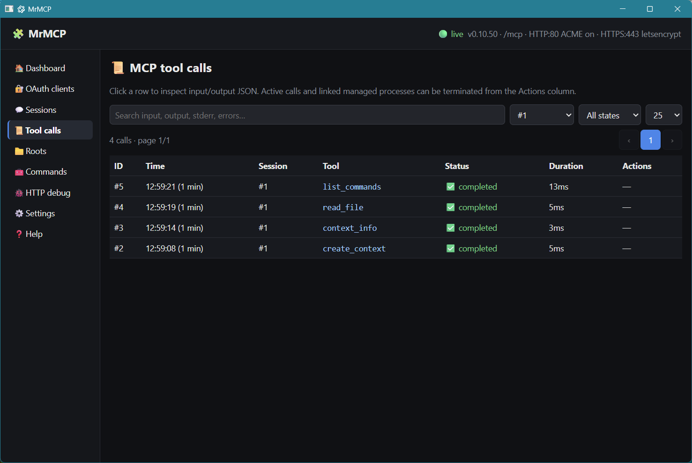

<p align="center"></p>

# MrMCP 0.10.54

MrMCP is a stateless Model Context Protocol server implemented in Deno. It exposes one authenticated MCP endpoint at `/mcp`, a loopback administration interface, filesystem and text-editing tools, an extra-command catalog, managed processes, a persistent JavaScript worker, OAuth and Basic authentication, TLS automation, and explicit `context_handle` capabilities for persistent application state.



The desktop window uses `jsr:@webview/webview@0.9.0`, imported directly by Deno. The project has no Node.js application, npm install, CLI scaffold, Rust, Tauri or Neutralinojs runtime.

## Project files

- `mrmcp.js` — backend, MCP endpoint, SQLite schema, administration UI and desktop launcher.
- `commands.yaml` — editable extra-command catalog. Source mode reads this root file directly; standalone builds embed it as the first-run template and materialize it beside `mrmcp.exe` only when no physical `commands.yaml` exists.
- `README.md` — user and operator documentation.
- `AGENTS.md` — implementation invariants and release checks.
- `assets/` — static WebView/build assets: `morphlex.js`, SVG/PNG branding, Windows ICO and administration screenshot.

## Requirements and startup

Requirements:

- Deno with `node:sqlite` support.
- Native dependencies required by `@webview/webview` on the target platform.
- Permission to listen on ports 80 and 443 when the public listeners are enabled.

Desktop GUI:

```bash
deno run -A --unstable-ffi mrmcp.js
```

Headless backend:

```bash
deno run -A mrmcp.js --backend
```

The administration interface is served at `http://127.0.0.1:7332/`. Desktop mode starts the backend as a Deno child process, waits for `MRMCP_READY`, opens the authenticated loopback URL in the WebView and terminates the child when the window closes. The initial window size is 1180×760.

The authenticated GUI serves `assets/` uniformly under `/assets/`. With `deno run`, those files come directly from the repository `assets/` directory. Standalone builds embed that directory with `deno compile --include assets`, so the WebView uses identical `/assets/...` URLs in source and standalone builds. `commands.yaml` is not a WebView asset: compile it separately with `--include commands.yaml`; on first standalone backend startup, MrMCP copies the embedded template beside the executable only if no editable physical `commands.yaml` exists there.

Windows standalone build:

```powershell
deno compile -A --unstable-ffi --include assets --include commands.yaml --icon assets/mrmcp.ico --output mrmcp.exe mrmcp.js
```

## MCP 2026-07-28 and stateless operation

MrMCP advertises and accepts only MCP `2026-07-28`.

That protocol revision removed the `initialize` / `initialized` handshake and the `Mcp-Session-Id` transport header. Every request is self-describing and independent. The protocol maintainers explicitly recommend that applications which need state across calls issue an ordinary explicit handle and require the model to pass it back as a tool argument.

References:

- [The 2026-07-28 Specification — No handshake or sessions](https://blog.modelcontextprotocol.io/posts/2026-07-28/#no-handshake-or-sessions)
- [SEP-2567 — Sessionless MCP via Explicit State Handles](https://modelcontextprotocol.io/seps/2567-sessionless-mcp)
- [SEP-2575 — Make MCP Stateless](https://modelcontextprotocol.io/seps/2575-stateless-mcp)

MrMCP implements that application-level pattern with an explicit `create_context` tool and a required `context_handle` argument on every other tool. The handle is an opaque bearer capability, not a transport session identifier.

### Create and reuse a context

1. Call `create_context` without `context_handle`.
2. MrMCP creates and returns a globally unique, unguessable `ctx_...` value.
3. Call `context_info` with that handle before repository work.
4. `context_info` returns the current absolute root and, when present, the root-level `AGENTS.md` or `agents.md` path to read and follow.
5. Pass the exact handle unchanged in `context_handle` on every later MrMCP tool call. Call `context_info` again after the operator changes the Session root.
6. A missing, unknown or expired handle does not execute the requested operation and does not mint a replacement automatically. Recover with `create_context`, then repeat the requested call.

Successful tool results repeat only the bearer capability as common metadata:

```json
{
  "context_handle": "ctx_..."
}
```

A missing, invalid or expired handle returns `isError: true` with an `error` message explaining that `create_context` must be called. No replacement handle is minted automatically. Contexts expire after 30 days without activity.

The handle itself selects the context after authentication. MrMCP does not bind contexts, processes or JavaScript kernels to the OAuth client or Basic credential that created them. Any authenticated client possessing a valid handle can use that context. The context row records best-effort metadata about the client that created it (authentication kind, OAuth client id/name when available, and User-Agent) for operator visibility only; those fields are not authorization or ownership controls.

### Why the GUI says “Sessions”

The administration interface labels contexts **Sessions** because that is convenient for operators. Each row is identified in the GUI by a short numeric primary key; the long `ctx_...` bearer capability remains internal to MCP calls. This is only a GUI term. MrMCP does not implement protocol sessions and does not use `Mcp-Session-Id`.

The Sessions table also shows best-effort creation-client metadata. MCP does not reliably expose the ChatGPT model or thinking/reasoning level, so MrMCP does not invent those values. Changing model or thinking level in the same ChatGPT conversation may cause ChatGPT to create another MCP context, so the same GUI Session is not guaranteed to persist across such changes.

## Authentication and tool access

Authentication controls access to MrMCP; `context_handle` selects persistent state after authentication.

- Authenticated OAuth or Basic clients receive every published built-in and custom tool.
- Anonymous clients receive no tools and cannot execute operations.
- There are no tool approvals, enable lists, execution switches, `allow_re`, `deny_re` or user-defined per-tool policies.
- OAuth consent authorizes the client itself, not an individual tool call.

The only public MCP endpoint is `/mcp`. OAuth protected-resource metadata is exposed for that single resource.

## Database policy

Development builds use one exact current SQLite schema and no compatibility layer.

- The database is `.mrmcp/mrmcp.sqlite` beside the application.
- `PRAGMA user_version` must exactly equal `DB_SCHEMA_VERSION`.
- A non-empty database with another version is rejected before schema changes.
- There are no migrations, `ALTER TABLE` upgrades, backfills, aliases, old-key imports or legacy identifier acceptance.
- After an incompatible development change, stop MrMCP and delete `.mrmcp/mrmcp.sqlite`.

The current schema gives every context a numeric administrative primary key in `contexts.id` while retaining a unique opaque `context_handle` for MCP calls. Tool-call and process rows store both the numeric `context_id` snapshot used by the GUI and the opaque handle used by the protocol. Contexts additionally store the creation authentication kind, OAuth client id/name when available, and User-Agent as observational GUI metadata. A context stores exactly one current `root_id`; root id `0` denotes the program directory.

## Roots and filesystem isolation

The Roots page lets the operator register named absolute directories and assign one current root to each Session. It is split into **📁 Roots** on the left and **💬 Sessions** with **No root assigned** on the right. Each named-root card contains its current Session assignments, and every Session item shows its creation time and last access.

- Drag a Session from the right-hand Sessions column into a named root to assign it.
- Drag a Session from a named root back to the right-hand Sessions column to remove its named-root association; root id `0` is stored immediately.
- Dragging directly between named roots reassigns the Session in one step.
- Disabled roots remain visible for editing/deletion but cannot receive Sessions.
- The Sessions page shows the current root name and path as read-only information; assignment is performed only from Roots.
- A root may be assigned to any number of contexts.
- Every context always has exactly one effective root.
- A new context starts on the fallback root beside `mrmcp.js`.
- Changing a Session's root affects new tool calls immediately.
- Existing background or interactive processes continue in the directory where they started.
- Disabling or deleting a root moves currently associated contexts to the fallback root without terminating processes.

The public `context_info` tool returns the absolute root directory currently assigned to the supplied context plus a nullable absolute `agent_guidance_path`. A non-null path means guidance is present; no separate boolean is needed. MrMCP checks only the root-level `AGENTS.md`, then `agents.md`; it does not scan parent or child directories. When the path is present, the agent must read and follow that file before modifying the repository. Root identifiers, available roots and other administrative metadata are not exposed through MCP tools.

All relative paths and new child-process working directories must remain inside the root captured at the start of the tool call.

## Built-in tools

Context and location:

- `create_context`;
- `context_info`.

Filesystem and text:

- `read_file`, `read_files`, `write_file`, `write_files`;
- `glob`, `grep`, `edit`, `replace`;
- `file_info`, `create_directory`, `copy_path`, `move_path`, `trash_paths`, `untrash_action`;
- `publish_file`.

Commands and persistent execution:

- `list_commands`;
- `exec`, `exec_start`, `exec_poll`, `exec_write`, `exec_kill`, `exec_list`;
- `js`, `js_add_node_module_dir`, `js_reset`.

`edit` accepts multiple files and multiple ordered exact edits per file. Each file is read once, its edits are applied sequentially in memory, every expected occurrence count is validated, and all files are written atomically with rollback.

`trash_paths` is the removal path for files and directories. It accepts explicit root-relative `paths`, an optional root-relative `glob`, or both. Each call creates `.trash/<action_id>/` plus sibling metadata `.trash/<action_id>.json`; the action id is the local date/time to the second with `-2`, `-3`, ... added only on collision. Nested selections are collapsed so moving a selected directory does not separately move its children. `untrash_action(action_id)` restores the whole action or restores nothing: it preflights every original target first and rolls back any moves if a restore step fails. MrMCP intentionally exposes no permanent filesystem-delete tool; removal is reversible through trash actions.

`glob`, `grep` and `replace` are intended to remove the need for improvised `uv`, Python or shell scripts during ordinary repository work:

- `glob` supports a start path, glob pattern, exclusions, hidden files, dependency directories and a result limit;
- `grep` supports literal or regular-expression matching, case sensitivity, globs, exclusions, context lines, hidden/dependency traversal, encoding selection, file-size limits and `content`, `files_with_matches` or `count` output;
- `replace` supports the same traversal controls, literal or regex replacements, preview mode, encoding/BOM/line-ending preservation, atomic rollback and an optional exact `expected_replacements` guard.

Every built-in tool publishes a strict tool-specific output schema. The only common field is `context_handle`; failed calls additionally use `isError: true` and an `error` string. Internal log identifiers and derived status flags are not exposed through tool results.

JavaScript kernels are created lazily and keyed by `(context_handle, root_id)`. Switching a Session to another root uses or creates that context-root kernel; switching back reuses its previous state. Different contexts never share JavaScript globals even when they use the same root.

Custom commands are described in `commands.yaml` and resolve below `.mrmcp/bin`. Executables found directly in that directory are also discoverable.

## Process environment

The setting **Include the system PATH in spawned processes and commands** is enabled by default.

- ON: `.mrmcp/bin` is prepended to the supplied or inherited system `PATH`.
- OFF: child processes receive only `.mrmcp/bin` in `PATH`.
- Other environment variables remain available.
- Shell expressions use `ComSpec` on Windows and `SHELL`, with `/bin/sh` as the Unix fallback.

## Text encoding and editing

Text tools support:

- UTF-8;
- UTF-16LE;
- UTF-16BE;
- Windows-1252;
- Latin-1;
- BOM preservation, insertion or removal;
- `LF`, `CRLF` and `CR` preservation or conversion.

Preferred editing order:

1. `edit` for one or more ordered exact edits per file and atomic multi-file changes;
2. `replace` for repeated literal or regular-expression replacements across files;
3. `write_file` / `write_files` for complete content;
4. `js` / `exec` only when the transformation genuinely requires parsing, computation or other programmatic logic.

## Administration interface

The interface contains:

- Dashboard;
- Clients;
- Sessions;
- Roots;
- Tool Calls;
- Commands;
- Http Log;
- Settings;
- Help.

Projects, Active calls, Custom tools and Approvals are intentionally absent. The GUI header and favicon use the MrMCP balloon+folder brand mark; the native window title remains **🧩 MrMCP**. Emoji are limited to navigation, headings, principal actions, destructive actions and compact states.

### Deno-owned event-driven rendering model

The GUI has no polling timer, auto-refresh setting, browser-side data fetch loop or duplicate refresh path. Deno is the only owner of graphical state.

The backend keeps one ephemeral `uiState` object containing:

- the current section and per-section scroll positions;
- focus and selection information needed after a morph;
- the optional OAuth-client filter on Sessions;
- command search, page, page size and availability filter;
- Tool-call query, Session-PK/status filters, numbered page and expanded database primary key;
- HTTP-debug filters and expanded database primary key;
- active dialog, confirmation or message;
- in-progress Root, Command and Settings drafts;
- self-test output and the last processed browser-input sequence.

The WebView does not keep an application-state object and does not query administrative JSON endpoints. Its responsibilities are deliberately narrow:

1. delegate click, change, input, submit, focus, keyboard, scroll and native drag/drop events;
2. serialize those events and send them to Deno over `/api/ui-input` WebSocket; the drag data carries only the numeric Session PK and never mutates visible DOM state;
3. receive complete server-rendered UI HTML over `/api/events` SSE;
4. apply the HTML to `#app` with Morphlex;
5. restore the scroll and focus values supplied by Deno.

Deno processes browser events sequentially. It updates `uiState`, executes database/filesystem/process actions, and schedules a render only when required. MCP calls, process changes, logs, OAuth changes, TLS changes and other backend subsystems use the same render scheduler.

Rendering is queued rather than performed synchronously inside the triggering operation. A short throttle coalesces bursts, only one render runs at a time, and additional requests received during a render cause one subsequent pass. Eta rendering uses its asynchronous API when available. When rendering completes, Deno broadcasts one `render` SSE event containing the full `#app` HTML and the authoritative scroll/focus metadata.

Eta chooses the active section with a conditional. `buildUiRenderModel()` queries only the data required by that section, then Eta renders the sidebar, active section, dialogs and section-specific rows. Inactive sections are neither rendered nor queried. Expanded Tool-call and HTTP rows are identified by their unique database primary key and are reconstructed by Eta after relevant backend events.

Native confirmation and alert state is not kept in the browser. Confirmations, errors and forms are represented in Deno `uiState` and rendered as ordinary Eta dialogs. The browser may perform a local clipboard write and may use the native drag `DataTransfer` object transiently to carry a Session PK to a root drop target; neither operation carries persistent or graphical application state.

### Help

The Help page documents the current ChatGPT Web setup flow for a custom MCP app: enabling Developer mode, entering the remote HTTPS `/mcp` endpoint, authenticating (OAuth is the preferred ChatGPT path), scanning tools, understanding MrMCP's authenticated full-tool access model, and configuring write/modify action controls where the ChatGPT plan/workspace exposes them. As of this build, OpenAI documents full MCP write/modify support for Business, Enterprise and Edu, while Pro custom MCP access is limited to read/fetch; the Help page notes that availability can change. It also warns that model or thinking-level changes may result in a fresh MCP context.

### Tool-call log

The Tool calls page supports:

- filter by numeric GUI Session PK and status;
- automatically apply the full-text query and every filter change without a Search button;
- numbered pagination above the table;
- complete timestamps with compact relative ages;
- compact rows without inline input/output JSON;
- Eta-rendered expanded details;
- Terminate and Force controls only when cancellation is real.

## TLS and connectivity

MrMCP uses fixed public listeners:

- port 80 for ACME HTTP-01 challenges;
- port 443 for MCP, OAuth and metadata;
- loopback port 7332 for the administration UI.

The Settings and Dashboard pages display listener state, active certificate, validity, trust, expiry, ACME request history, backoff and next attempt. A valid certificate already stored in `.mrmcp` is reused.

## Development changelog

### 0.10.54

- Began versioning the root `commands.yaml` catalog instead of leaving it hidden by the root ignore rule.
- Kept `commands.yaml` outside `assets/`: source mode edits the root file directly, while standalone builds embed it separately with `--include commands.yaml` only as a first-run template.
- On standalone backend startup, materialize the embedded `commands.yaml` beside the executable only when that physical file is absent; existing user edits are never overwritten.
- No database schema change; schema version remains 4.

### 0.10.53

- Added reversible `trash_paths` for files, directories and glob selections. Each call stores one timestamped action below `.trash/` with a sibling JSON manifest and returns its `action_id`.
- Added `untrash_action(action_id)` with all-or-nothing restore semantics and rollback on a mid-restore failure.
- Kept trash actions intentionally simple: no hashes or redundant integrity metadata; MrMCP assumes `.trash` is managed only by MrMCP while retaining the preflight needed for transactional restore.
- `trash_paths` and `untrash_action` are not annotated as destructive because they move data reversibly; removed the permanent `delete_path` tool so filesystem removal is trash-only.
- No database schema change; schema version remains 4.

### 0.10.52

- Moved GUI/browser resources into a single versioned `assets/` directory: Morphlex, SVG/PNG branding, the multi-resolution Windows ICO and the administration screenshot.
- Added authenticated `/assets/...` static serving that reads the same paths from disk under `deno run` and from Deno's virtual filesystem when `assets/` is embedded with `--include assets`.
- Removed the inline brand SVG/data URL from `mrmcp.js`; the GUI header and favicon now reference `assets/mrmcp-logo.svg`, while the native window title remains **🧩 MrMCP**.
- Moved the README screenshot reference to `assets/mrmcp-screenshot.png` and kept the screenshot separate from the logo asset.
- Recompiled the Windows executable with `--include assets --icon assets/mrmcp.ico`.
- No database schema change; schema version remains 4.

### 0.10.51

- Centralized Session root assignment on the Roots page: **📁 Roots** appear on the left with their associated Sessions, while **💬 Sessions / No root assigned** appears on the right; Session items show creation and last-access timestamps.
- Added bidirectional drag-and-drop assignment between the Default root and named roots, plus direct root-to-root reassignment; Deno remains authoritative and the browser transports only the Session PK and target root id.
- Removed the root selector from Sessions; the current root label and path remain visible there as read-only information.
- Updated the sidebar labels/order to **Clients**, **Sessions**, **Roots**, **Tool Calls**, **Commands**, **Http Log** and compacted the Commands table actions vertically.
- No database schema change; schema version remains 4.

### 0.10.50

- Moved OAuth clients directly below Dashboard in the sidebar.
- Added a Session count to each OAuth client row and a **View sessions** action that opens Sessions filtered by that OAuth `client_id`; the filter remains visible until cleared.
- Changed GUI date formatting so timestamps from the current local day show only the time, while older/future dates keep their calendar date and existing relative-age suffixes remain unchanged.

### 0.10.49

- Added best-effort creation-client metadata to Sessions: authentication kind, OAuth client id/name when available, and User-Agent. Model and thinking/reasoning level are intentionally not inferred because MCP does not reliably expose them.
- Added a Sessions continuity notice explaining that changing ChatGPT model or thinking level may create a new MCP context even inside the same conversation.
- Added a Help section with ChatGPT Web Developer-mode, custom MCP app, OAuth, tool-scan and write-action setup guidance.
- Moved Tool calls directly below Sessions in the sidebar and retained the one-click per-Session filtered Tool-call view.
- Advanced the clean SQLite schema to version 4; delete `.mrmcp/mrmcp.sqlite` before restarting this development build.

### 0.10.48

- Added a numeric primary key to every GUI Session while preserving the opaque `ctx_...` capability for MCP protocol calls.
- Stored the Session PK on Tool-call and process rows so logs keep a stable short identifier even after a Session is deleted.
- Changed the Sessions table, Tool-call Session column and Session filter to show the numeric PK instead of the long handle or generic `context` label.
- Renamed the root-id-0 selector option to **Default root**.
- Removed the Tool-call Search button; text, Session, status and page-size filter changes now refresh automatically through the existing Deno-owned render pipeline.
- Advanced the clean SQLite schema to version 3.

### 0.10.47

- Reduced the public tool-result envelope to the required `context_handle` plus tool-specific fields.
- Removed redundant `context_status`, `operation_executed`, `retry_required`, `recovery_tool` and recovery `message` fields; errors now use `isError: true` and one `error` string.
- Removed public `execution_log_id` values while retaining complete internal administration logs.
- Removed `agent_guidance_present`; a nullable `agent_guidance_path` now expresses both presence and location.
- Replaced the internal GUI context status string with a direct `expired` boolean.
- Removed constant success flags and array-length duplicates from `create_directory`, `delete_path`, `glob`, `grep` and `replace` results.

### 0.10.46

- Replaced `get_cwd` with `context_info`, which returns the current absolute root and the optional root-level `AGENTS.md` / `agents.md` guidance path.
- Directed agents to call `context_info` after context creation and root changes, then read and follow `agent_guidance_path` when present.
- Added explicit tool-specific output schemas instead of one permissive generic result schema.
- Expanded `glob`, `grep` and `replace` with exclusions, hidden/dependency traversal, file-size and encoding controls; `replace` also gained an exact `expected_replacements` guard.
- Updated tool descriptions and server instructions to prefer structured file tools and avoid shell, `uv` or Python for covered operations.

### 0.10.45

- Replaced `server_opaque` with the public bearer capability `context_handle` and added `create_context`.
- Removed authenticated-client ownership from contexts, processes and JavaScript kernels; possession of a valid handle selects the context after authentication.
- Replaced the MCP `workspace` tool with the minimal `get_cwd` tool. Root assignment remains exclusively in the Sessions/Roots administration UI.
- Made each context reference exactly one current `root_id`, freely reassignable; a root may serve many contexts and existing processes are left untouched when the assignment changes.
- Scoped lazy persistent JavaScript kernels by context and root.
- Replaced `list_files`, `search_files`, `edit_file`, `edit_files` and `replace_files` with `glob`, `grep`, `edit` and `replace`.
- Fixed multi-edit semantics: ordered edits for the same file are now applied to one in-memory document and all files are committed atomically with rollback.
- Added root snapshots to tool-call and process logs and moved the clean SQLite schema to version 2.

### 0.10.43

- Expanded `AGENTS.md` with the full UI-state design rationale and failure mode that motivated the architecture.
- Made explicit that every visible state transition, including navigation and row expansion, is Deno-owned and Eta-rendered.
- Documented normalized user/backend event handling, primary-key-based expanded rows, lazy section-scoped queries and the single throttled asynchronous render queue.
- Added release checks that reject imperative browser UI state and inactive-section data loading.

### 0.10.42

- Moved every ephemeral graphical state value from the WebView into the Deno backend.
- Replaced browser-side `globalThis.mrmcpUiState`, `/api/state` and `/api/render` calls with a WebSocket input channel and an SSE HTML output channel.
- Added a single sequential Deno input dispatcher for navigation, forms, filters, pagination, expanded rows, dialogs, focus and scroll.
- Added a throttled/coalescing asynchronous render queue; backend and MCP events use the same queue.
- Changed the WebView into a thin event sender and Morphlex HTML receiver.
- Made confirmations and error messages server-owned Eta dialogs.

### 0.10.41

- Added a real global ephemeral UI state object.
- Restored the missing unified `dispatchUiEvent` implementation that prevented sidebar navigation.
- Moved current section, filters, pages, expanded row primary keys, dialogs and self-test output into the state object.
- Eta now conditionally renders only the current section; Morphlex applies every UI transition.
- Added section-specific server projections so inactive pages do not query their tables.
- Moved expanded Tool call and HTTP details from imperative DOM insertion into Eta templates.
- Expanded README and AGENTS documentation, including the MCP 2026-07-28 stateless rationale.

### 0.10.40

- Added a restrained emoji vocabulary for faster visual scanning.

### 0.10.39

- Removed experimental root drag-and-drop and diagnostics.
- Restored conventional root creation, editing, enable/disable and deletion.

### 0.10.38

- Reduced the initial desktop window to 1180×760.

### 0.10.37

- Standardized visible branding as **MrMCP** and added the 🧩 header/window icon.

### 0.10.36

- Replaced GUI polling with SSE-driven Eta → Morphlex updates.

### 0.10.35

- Renamed the operator view to Sessions.
- Removed the global default-root option; unassigned values use the `mrmcp.js` directory.

### 0.10.34

- Returned the desktop launcher to direct `@webview/webview` after superseded Tauri and Neutralino experiments.

### 0.10.32–0.10.33 — superseded experiments

- Explored Neutralino-based desktop shells; fully removed in 0.10.34.

### 0.10.29 — superseded experiment

- Explored a Tauri v2 desktop shell; fully removed in 0.10.34.

### 0.10.30–0.10.31

- Replaced transport-derived session identity with explicit tool arguments for the stateless protocol.
- Stabilized the final field name as `context_handle` and removed “context” terminology from agent-facing schemas.

### 0.10.28

- Removed tool-call approvals and every associated queue, state and database field.
- Removed `allow_re` and `deny_re`; authentication became the only tool-access boundary.

### 0.10.27

- Added session-oriented administration, root assignment, tool-call pagination and termination controls.
- Added encoding, BOM and line-ending controls to text tools.
- Added the system-PATH process setting.

### 0.10.24–0.10.26

- Added relative ages beside log timestamps.
- Consolidated to one `/mcp` endpoint.
- Introduced early session/root and event-log improvements that were later adapted to explicit opaque handles.
