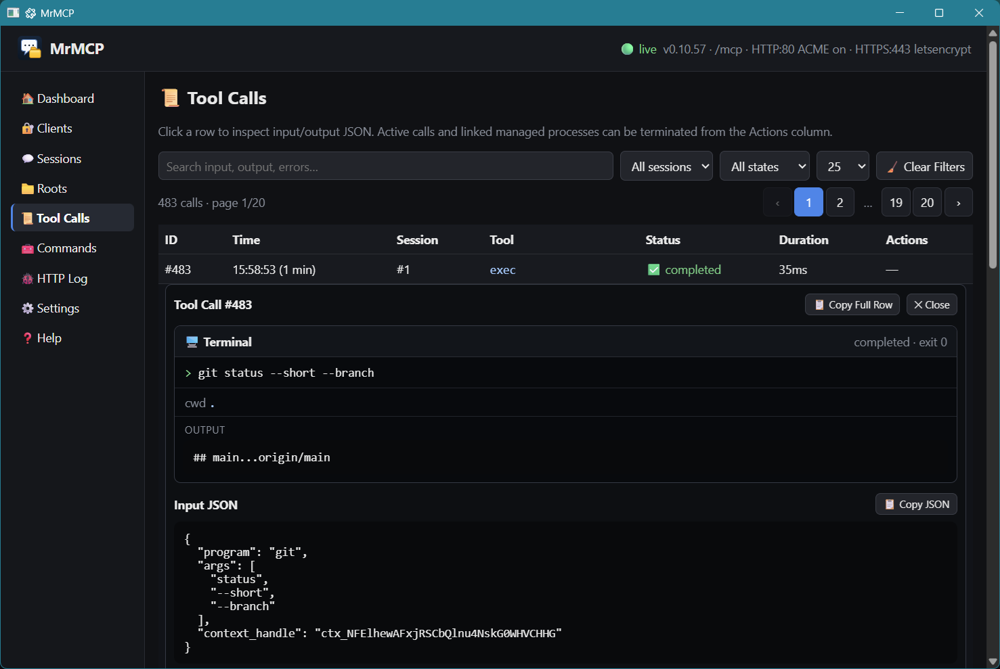

<p align="center"></p>

# MrMCP 0.10.146

MrMCP is a stateless Model Context Protocol server implemented in Deno. It exposes one authenticated `/mcp` endpoint, Workspace-scoped Sessions, filesystem and process tools, OAuth/Basic authentication, TLS automation, and a local Tauriless administration UI.



## Features

- MCP `2026-07-28` with explicit `chat_session` Session capabilities.
- Named Workspaces with drag-and-drop Session assignment.
- Persistent ChatGPT goals through `chat_set_goal`: send a follow-up after Tool Call inactivity, using a dedicated Chrome login profile. Sessions shows the association, timer state and Stop goal control.
- AAF desktop automation through `desktop_auto`, including zero/one/many model-visible WebP/PNG screenshots mixed with structured OCR, geometry and state output; the local Automation page reuses **Payload-retained** Tool Calls/screenshots for inspection and can replay a scenario directly as a local user action without creating another Tool Call.
- Low-level Chrome DevTools Protocol control through [`@mefistofelix/cdp.js`](https://github.com/mefistofelix/cdp.js) using always-batched `cdp_call`, with persistent browser/profile and logical page labels plus subscription/poll access to CDP notifications; the local Browser page summarizes existing profile/target/ring/subscription state; recorded request/response inspection and Replay are available for **Payload-retained** Tool Calls only.
- Explicit persistent Global/Session/Workspace key-value memory through `memory_find` and `memory_set`, with explicitly typed JSON/text values, TTL and a local Memory manager.
- Filesystem, text search/editing, reversible trash and generated-file publishing.
- Foreground and persistent processes with progress streaming when requested.
- Persistent JavaScript kernels scoped to Session + Workspace.
- Extra command catalog through `commands.yaml`.
- User-managed MCP guided prompts through `guided_prompts.yaml`, with Eta templates, two editable starter examples (one argument-free and one parameterized), and a built-in template/model help view.
- OAuth and Basic authentication.
- Automatic TLS/certificate handling.
- Tool Call and optional HTTP diagnostic logs. Tool Call history has independent **Disk / Memory** storage and **Payload / Metadata** retention policies. Disk history survives restart; Memory history uses volatile SQLite TEMP storage. Payload stores exactly the canonical MCP JSON-RPC request and response packets once; Metadata stores neither packet. The fullscreen Tool Call debugger interprets nested JSON/YAML, multiline text, readable Base64 and images only while viewing a row, without persisting decoded copies. Disk retention is configured in hours and Memory retention in minutes. Functional process/CDP/Memory/Published/Trash state, authentication, Sessions, Workspaces and configuration are never disabled or made volatile by the Tool Call logging policy.
- Local desktop UI with system tray and native notifications.
- One MIME-aware `publish` MCP App helper for Workspace paths, direct text and Base64 bytes, with persistent deduplicated `.mrmcp/publish/` files, inline/download presentation hints, multi-Workspace publication references and a local Published manager for filtering, native opening and deletion.

## Requirements

- Deno with `node:sqlite` support.
- A Tauriless-supported platform.
- Permission to bind public ports 80 and 443 when those listeners are enabled.

## Run

Desktop GUI:

```bash
deno run -A --unstable-ffi mrmcp.js
```

Headless backend:

```bash
deno run -A mrmcp.js --backend
```

Register a Workspace without starting the server:

```bash
deno run -A mrmcp.js --add-workspace "Workspace name" "/path/to/workspace"
```

The desktop UI is local-only and opens no GUI TCP listener. Public MCP/OAuth traffic uses HTTP/HTTPS listeners; occupied base ports fall back in `+50` steps without rewriting configuration.

Settings shows the absolute **Data Directory** path in every tab. Portable builds keep `.mrmcp` beside the executable; source mode keeps it beside `mrmcp.js`; the macOS app uses `~/Library/Application Support/MrMCP/.mrmcp`.

If the database schema is incompatible at startup, the desktop asks whether to **Start Fresh** or **Quit**, showing both the current folder and proposed backup path. Start Fresh renames the entire `.mrmcp` folder to a sibling `.mrmcp.backup-YYYYMMDD-HHmmss` folder (with a suffix when necessary), then creates new settings, credentials and data. Existing backups are never replaced, and Quit preserves the current data. Headless and one-shot modes require terminal confirmation; unattended runs stop with recovery instructions.

## Workspaces and Sessions

MrMCP keeps transport state stateless. Persistent application state is selected explicitly with a `chat_session`.

1. Call `init_chat_session()` once to create a chat Session without opening a Workspace.
2. Pass its exact `chat_session` on every subsequent tool call, including discovery and diagnostics.
3. Call `list_workspaces(chat_session)` and then `open_workspace(chat_session, name)` when a Workspace is needed. Use `create=true` only to explicitly create a missing Workspace as an empty Desktop folder.
4. To switch Workspace, call `open_workspace` with the same `chat_session` and another name; the Session identity stays unchanged.

File operations, new processes, configured commands and JavaScript kernels require an open Workspace. Desktop/CDP automation, discovery, diagnostics, memory, Telegram and text/Base64 publication can run before one is selected. Invalid or expired session values fail without creating replacements.

`open_workspace` also returns the Workspace name, absolute working directory, optional `agent_guidance_path`, whether this call created the Workspace, and a compact Memory summary containing live counts plus up to five latest keys for Global, Workspace and Session scope. Guidance resolution prefers Workspace-root `AGENTS.md` / `agents.md` and falls back to `CLAUDE.md` / `Claude.md` / `claude.md`; when the returned path is present, read and follow it before repository work.

The administration UI displays Sessions with short numeric ids. The opaque `ctx_...` value remains the MCP bearer capability. A Session may move between Workspaces, while historical Tool Calls retain the Workspace snapshot captured when each call started.

`chat_set_goal(chat_session, goal, timeout_seconds?)` enables automatic follow-ups for a ChatGPT conversation. First use **Settings → Goals → Login ChatGPT** and sign in in the separate Chrome profile. The login observer automatically recognizes an existing or newly completed login from the site’s recent-chat traffic. Login recognition is independent of editor readiness. Settings shows Opening, Checking, Signed in, Sign-in required or a failure, separately from the monitoring enable switch. The GUI remains responsive while Chrome opens. Until verification succeeds, goals remain paused and never open Chrome automatically. Setup uses a visible browser with images and pauses automatic work; it also works while the global switch is off. Close that window after verification to apply the saved monitoring launch options. Login readiness persists across restart, but an observed logout during matching or sending suspends automatic work until Login ChatGPT is used again. This readiness is independent of the global enable switch: successful login never turns that switch on, and toggling it does not change login readiness. New unassociated goals set before login require another `chat_set_goal` afterward. **Settings → Goals** contains the global enable switch (on), default inactivity timeout (5 minutes), Retry missing chat matches at startup (off), Stop the current response before sending (off), Headless (off), Disable page images (off; images load by default) and spawned process visibility (Automatic: windowsHide follows headless). Disabling stops the background scheduler and monitor; the tool stays published and returns `disabled` without setting a new goal. Saved goals and the dedicated `.mrmcp/cdp/mrmcp-chatgpt/` login profile are retained. Launch options apply on the next browser launch; keep headless off for interactive login/challenges. MrMCP reuses one monitoring tab and observes the site’s own recent-list/history traffic through cdp.js, associates only an exact `chat_session` from an active-branch tool call, and falls back to rendered tool details when capture is unavailable. DOM controls use machine attributes and native HTML/ARIA structure rather than translated labels. Each explicit nonempty set for an unassociated Session schedules one bounded matching attempt. Missing login, no match, browser errors or interruption end that attempt; ticks, login completion and settings changes do not repeat it. By default restart does not resume any missing match, including requests still queued before shutdown. Enable Retry missing chat matches at startup to schedule one attempt per active unassociated goal at each startup, only when global goal management is also enabled and the login profile is verified. Otherwise call chat_set_goal again to retry. Existing associations are reused. Login, capture and UI failures remain visible in Sessions. Website changes can still require adapter updates.

Once linked, MrMCP Tool Call arrivals/completions reset the inactivity interval. MrMCP sends the exact saved text after that interval and repeats while eligible; it does not evaluate completion or stop because ChatGPT says the goal is achieved. Ordinary chat messages and other connectors' calls do not reset this timer. Association and any already-due send run consecutively on the same page, without an extra scheduler tick or reload. Once submission is confirmed, MrMCP moves to the next goal without waiting for ChatGPT's reply. A responding destination still receives an attempted goal submission when the inactivity timer expires, including when an earlier Tool Call is still running. Enable Stop the current response before sending to interrupt that response first; this option applies to subsequent attempts without restarting Chrome. New Tool Call activity resets the timer. Existing drafts in the shared tab are preserved and can still delay navigation. The scheduler checks every five seconds, so the timeout is an earliest delivery time, not an exact alarm. Goal and association survive restart and history cleanup. Set `goal:""` or use **Sessions → Stop goal** to stop; an uncertain send pauses until the operator checks the chat and explicitly sets the goal again. A newer goal replaces an earlier goal associated with the same conversation. MrMCP must be running, and an interactive desktop is needed for Chrome login. See the [complete Goals contract](TOOLS.md#chat_set_goal) for association rules, timer calculation, send confirmation, states, persistence and limits.

## Tools

Session and Workspace:

- `init_chat_session`, `chat_set_goal`, `chat_goal_debug`, `list_workspaces`, `open_workspace`, `tools_log` — chat initialization/goals, Workspace selection and history inspection.
- `workspace_dev_preferences_write` — only on explicit user request, copy sidecar `DEV_PREF.md` from beside MrMCP into the current Workspace when that file is absent; never overwrite an existing project file or return preference content.

Desktop and browser automation:

- `desktop_auto` — execute one AAF YAML scenario through Auto.js; arbitrary final state is preserved and retained screenshots are returned directly as MCP image content for model vision.
- `cdp_call` — send an always-present `calls[]` batch spanning browsers/targets; each entry may omit `browser` to use the persistent `main` profile. `browser` accepts a name string or an object with required `name` plus `headless`, `executable_path`, `user_data_dir`, `args`, an existing debugging `port` with optional `host`, `http_url` discovery or a direct `websocket_url`. `target` also accepts an object with required `name`, native `create_params` and switches for Runtime, Network, Page, ServiceWorker, focus, binding and BackgroundService setup (`initialize:false` skips all optional setup); advanced options are reused by name for the current server run and must be supplied again after restart. Every operation uses `{method,params}`, with standard CDP names or local XPath extensions `_.click` / `_.find`; standard `Page.captureScreenshot` may optionally return a Base64 screenshot post-processed through the public Auto.js `auto.vips` API to scaled WebP (current encoder Q=80) while preserving all normal CDP screenshot params.
- `cdp_subs`, `cdp_poll` — add/remove runtime subscriptions (including `*`, target/method-prefix and full-message regex filters) and read bounded CDP traffic through ascending cursors or ad-hoc polling.

Memory:

- `memory_find` — search one or many memory scopes, or `*` for Global + current Session + all Workspaces, by exact/prefix key, literal or regex text, set date and stable pagination.
- `memory_set` — set/replace/delete text values with explicit `json=true|false`; JSON text is validated before storage, with optional TTL in the selected Global, Session or Workspace scope.

The desktop **Memory** page filters stored values by scope, Session, Workspace, set date and text, labels JSON vs TEXT, and allows creation, full value/type/TTL inspection, editing and confirmed deletion. New entries explicitly choose Global scope or an existing Session/Workspace owner. JSON values use an editable JSON tree with node-level operations; text values use the plain text editor, and switching TEXT ↔ JSON never discards the current draft value. Expired TTL rows are removed automatically; Clear Operational Data preserves Memory.

Filesystem:

- `fs_glob`, `fs_grep`, `fs_read`, `fs_navigate`, `fs_stat`
- `fs_write`, `fs_edit`, `fs_text_convert_encoding_eol` — explicit lossless charset/EOL/BOM conversion for named existing text files, with unchanged detection and no implicit repository normalization.
- `fs_mkdir`, `fs_copy`, `fs_move`, `fs_trash`, `fs_untrash`
- `publish` — publish exactly one Workspace path, text string or Base64 payload with a required MIME type, optional filename/title/description and an `auto|inline|download` presentation hint.

The `fs_*` surface is multi-file where appropriate, stateless for navigation/pagination, uses opaque file fingerprints for optimistic concurrency, and reports independent per-entry outcomes instead of cross-entry rollback. `fs_glob` defaults to lightweight path/type pages and adds size/timestamps/link targets only with `metadata=true`; `fs_grep` pages by explicit result count with stateless `resume_after`, while `fs_read` keeps its per-file text ceiling and per-file `next_start_line` continuation without an aggregate batch byte budget. See `TOOLS.md` for the complete tool contracts and rationale.

Filesystem and retrieval tools provide compact text summaries of result counts, errors and continuations alongside the complete structured result. `fs_grep` reports the effective `max_file_bytes` and page-local `skipped_large_files`, making incomplete search coverage visible even when no matches are returned. Use the available Cymbal catalog command for symbol/caller exploration and the filesystem tools for textual search and file operations.

Settings → **Files** controls automatic encoding detection for reading and searching: **Initial 16 KiB** (default, faster) or **Complete file** (more thorough). Sample mode retries full detection when confidence is low or its charset cannot decode the entire file, but can still miss later charset clues. File edits and conversions always use complete detection; an explicit encoding skips detection.

Settings → **Process** can disable Git's automatic CRLF conversion by injecting `core.autocrlf=false` (enabled by default). Existing CRLF checkouts created with `autocrlf=true` may appear modified under this policy without any file edit; switch the option off to use the repository/machine policy. `.gitattributes` and explicit `git -c` options still apply. Saving unrelated settings leaves the MCP listeners running.

Commands and execution:

- `discover_commands` returns the complete available extra-command catalog in YAML order, with descriptions and documentation links. Agent discovery can be globally enabled/disabled from the Commands page without changing the catalog or executables.
- `exec`, `exec_start`, `exec_attach`, `exec_write`, `exec_kill`, `exec_list`, `exec_status`
- `js`, `js_add_node_module_dir`, `js_reset`
- `tools_schema` — inspect canonical live MCP descriptors; `tools_log` — query Tool Calls that reached the current Session across both Disk and Memory history, using `detail=summary` by default or `detail=full` to retrieve the retained canonical `mcp_request` / `mcp_response` packets.
- `telegram_req` — make one generic pre-authenticated Telegram Bot API JSON request using the Bot token configured by the user on the dedicated **✈️ Telegram** sidebar page.

Filesystem removal is reversible: `fs_trash`/`fs_untrash` use explicit `trash_id` transactions instead of a permanent delete tool. All Workspaces share the single MrMCP-managed `APP_DIR/.mrmcp/trash/` payload store; MrMCP never creates `.mrmcp` metadata directories inside named Workspaces. Trash transaction/item metadata lives in SQLite (`trash_transactions` / `trash_items`) with original path, cached type and cached byte size for non-directory payloads; directory size is deliberately left unknown to avoid recursively scanning a tree before a rename; no JSON manifest copy is written. The desktop **Trash** page uses the DB for inventory/sidebar counts and checks each tracked payload live on disk, making missing payloads explicit while preserving their cached metadata until deleted. Restore/delete and Empty Trash remain independent of Tool Call logging.

Foreground `exec` defaults to **45 seconds** but `timeout_ms` may be raised up to **1 hour**. High request timeouts deserve care: some clients/proxies/gateways retry or replay long requests (a ~60-second replay boundary was observed in ChatGPT testing). `exec` and `exec_start` therefore accept optional client-chosen `operation_id`: within the same Session and tool, identical retries reuse the original process while it is active and for **5 minutes after completion**; different process arguments with the same live key are rejected, and the key may be reused normally after the grace period. This key is transient replay protection, not a permanent Session-wide identifier. Prefer `exec_start` for long or non-idempotent jobs and poll with `exec_status` or bounded `exec_attach` calls. `exec_attach` defaults to 45 seconds, allows up to 1 hour, and returns `wait_timed_out=true` when only the attachment wait expires while the persistent child remains running; shorter repeated attaches avoid overlapping retry windows. Persistent processes use the integer `exec_id` returned by `exec_start`; a replay-protected `exec_start` returns that same `exec_id`. Follow-up process tools require the same Session `chat_session`. Process runtime/history is owned by the process subsystem and remains independent of Tool Call Disk/Memory storage, payload retention, retention pruning and Tool Call Clear.

## Guided prompts

`guided_prompts.yaml` is the authoritative guided-prompt catalog exposed through MCP `prompts/list` and `prompts/get`. The local Guided Prompts page creates, edits and deletes entries directly in that file. Templates use Eta and receive prompt arguments plus sanitized server/runtime context; when a prompt declares and receives a valid `chat_session`, the template also gets that Session and its current Workspace. The Guided Prompts page has a dedicated Template Help view with the YAML shape, Eta examples and model fields.

## Authentication and networking

Authenticated OAuth or Basic clients receive the published tools; anonymous clients do not.

The only public MCP protocol endpoint is `/mcp`. MrMCP advertises MCP `2026-07-28` and does not use `Mcp-Session-Id` transport sessions. Ordinary calls return JSON. Foreground process calls can use request-scoped SSE progress when `_meta.progressToken` is supplied, while the final result still contains the complete transcript; request-scoped process waits default below common retry boundaries but may be explicitly increased; persistent `exec_start` remains the recommended path for long work because its child is independent of one HTTP request lifetime.

Base public ports are:

- HTTP `80` — ACME HTTP-01.
- HTTPS `443` — MCP, OAuth and metadata.

ACME HTTP-01 is available only while the effective HTTP listener remains on port 80.

## Desktop application

Desktop mode uses Tauriless from npm latest and keeps the native event loop plus Deno backend Worker in one OS process. The window can be hidden to the tray without stopping MrMCP. Native directory drops can add Workspaces, and Session/Workspace/Tool Call notifications are configurable independently. Tool Call notifications default off; Session and Workspace notifications default on. Saved preferences are preserved.

Windows standalone builds use `--no-terminal` and the versioned application icon. macOS releases are Finder-launchable `MrMCP.app` bundles distributed inside DMG images.

## Release binaries

A version tag matching `mrmcp.js` `VERSION` triggers `.github/workflows/release.yml`. The GitHub Release contains:

- `mrmcp-windows-x64.exe`
- `mrmcp-linux-x64`
- `mrmcp-macos-x64.dmg`
- `mrmcp-macos-arm64.dmg`

The macOS app is currently ad-hoc signed; warning-free first launch of an Internet-downloaded build requires Developer ID signing and Apple notarization.

## Project files

- `mrmcp.js` — server, tools, SQLite, local UI and desktop launcher.
- `commands.yaml` — editable extra-command catalog.
- `guided_prompts.yaml` — editable MCP guided-prompt catalog and Eta templates.
- `README.md` — current user/operator overview.
- `CHANGELOG.md` — release history.
- `AGENTS.md` — implementation invariants, server-authoritative Web GUI/Morphlex/state/channel rules and release checks.
- `LICENSE` — MIT license.
- `.github/workflows/` — release and native macOS GUI test workflows.
- `assets/` — Morphlex, branding, icons and screenshots.

Runtime data lives under `.mrmcp`. Packaged macOS builds keep mutable state, `commands.yaml` and `guided_prompts.yaml` under `~/Library/Application Support/MrMCP/` rather than inside the application bundle.

## Changelog

See [CHANGELOG.md](./CHANGELOG.md).

## License

MrMCP is licensed under the [MIT License](./LICENSE). Third-party components retain their respective licenses.
